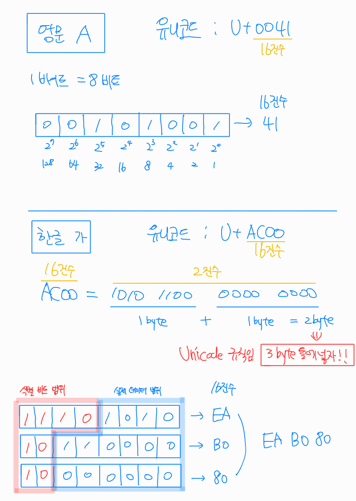
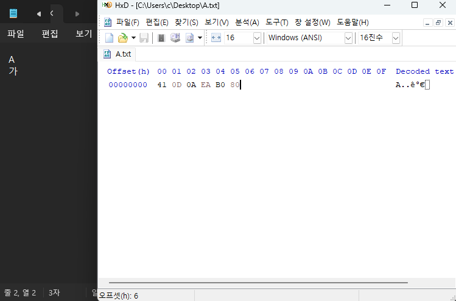

# 문자와 인코딩

- 이 노트는 `인프런-모르면 야근하는 문자 인코딩 완전 정복 / 널널한개발자`의 강의영상을 보며 학습한 내용을 정리했습니다.

---

> 문자의 실체는 양의 정수이다.

# 1. ASCII

- American Standard Code for Information Interchange
- 7bit 체계로 시작 
  - 영문 대/소문자, 숫자, 특수문자
  - 총 128개가 안됐음
- 8bit 체계로 확장
  - 영문을 넘어 유럽의 다양한 언어 등 확장문자를 표기할 수 있도록 1비트 추가해서 확장
  - 기존 ASCII 범위는 유지하고 128~255 확장영역 활용

> 여전히 다 포함하지 못함 => `Unicode` 탄생

# 2. Unicode

- 전세계 모든 문자를 표현하기 위한 목표로 만들어진 코드체계로 ASCII 코드 구조를 차용
- `U+16진수` 형식으로 표기 - _U+0041, U+AC00 등_
- 기존 ASCII 범위는 유지

> ### `문자체계(유니코드)`과 `인코딩`은 다르다.
> 
> 문자체계는 말 그대로 문자를 `표현`하는 방식을 말한다. ASCII 문자체계에서 A는 65였고 유니코드에서는 U+0041이다.
> 
> 반면 인코딩은 해당 문자를 영속화하거나 네트워크로 전송하기 위해 바이트스트림 형태로 변경하는 작업을 하는 `방식`을 이야기한다.
> U+0041을 `UTF-8` 방식으로 인코딩하면 `0x41` 이지만, `UTF-16` 방식으로 인코딩하면 `0x0041`이다.
> 
> 문자체계는 문자들을 숫자로 매핑해둔 문자표현 방식(코드 포인트)이고, 인코딩은 컴퓨터(메모리)가 읽기 위한 변환방식이다.

# 3. UTF

- UTF-8은 웹 서비스를 포함한 여러 분야에 가장 많이 사용되는 사실상 표준 규칙
- 영문은 `1byte` (ASCII 호환), 나머지는 `2~4byte` 가변길이로 인코딩
  - 영문 A(U+0041)는 `0x41` - 1byte
  - 한글 가(U+AC00) 는 `0xEA 0xEB 0x80` - 3byte

## UTF-8 변환 규칙

- 선행 바이트(첫 바이트)에 글자 당 길이를 표시해서 어디서 끊어 읽는지 알 수 있음
- 첫 바이트 정보에 글자당 길이 표시
  - 0xxx xxxx: 1바이트
  - 110x xxxx: 2바이트
  - 1110 xxxx: 3바이트
  - 1111 0xxx: 4바이트
- 두 번째 부터는 모두 10xx xxxx 형태

- 메모장에서 저장한 `A\n가` 가 16진수로 어떻게 표현되는지 확인한 내용
- `0D 0A`는 개행문자

# 4. DB와 인코딩

- 저장되는 데이터의 형식에 `이모지`와 같은 확장 영역의 데이터가 포함되는지 반드시 고려해야함

## MySQL
- 현재에는 다국어 및 이모지 등의 확장 형식이 포함되는 일이 많기 때문에 `utf8mb4`가 권장됨
  - 기존 utf8의 최대 3바이트와 달리 유니코드를 모두 아우르는 4바이트를 지원하기 때문
- 뒤에 붙는 `_general_ci`, `unicode_ci`와 같은 것은 검색에 사용되는 인덱스의 정렬 형식을 이야기함
  - `_ci`는 대소문자를 구분하지 않음
  - `_bin`은 대소문자를 구분함
  - `_ci`는 `where name = 'iphone'` 하면 `iPhone`도 나오나, `_bin`은 안나옴 
> 따라서 현대 웹서비스에 사용되는 DB에는 `utf8mb4_unicode_ci`가 표준으로 권장됨

## Postgresql
- postgresql DBMS는 Mysql보다 규칙에 어긋나는 것은 절대 허용하지 않는다는 철학이 더 강함
- 때문에 DB를 처음 생성할 때 정렬 규칙, 문자 분류 등을 미리 결정함
- `_ci`의 컬럼이 없기 때문에 대소문자 무시를 위해서는 `where name ILIKE 'iphone'`를 사용하거나, `citext` 확장모듈 등을 사용함
- `utf8mb4`같은것은 없이 `ENCODING = 'UTF8'`이라고 설정되어 있으면 4바이트 가변 길이 저장을 지원함

# 5. URL과 인코딩
- 한글은 UTF-8로 변환 후 %를 앞에 붙여 16진수 값을 그대로 표시함
- 공백문자는 `%20` 혹은 `+`로 처리 

# 6. Base64 인코딩
- 8비트 데이터를 6비트 단위로 잘라서 ASCII 코드로 표현하는 인코딩 방식
  - 패딩(비트수가 안맞아서 발생하는 여백)은 `=`로 채움
  - 패딩 등으로 인해 실제 데이터 크기는 약 33% 증가함
- 단손히 매핑테이블을 가지고 인코딩-디코딩 하는 것이기 때문에 보안성은 없음
- HTTP에서 유용하게 활용함
  - E-mail 전송 시 이미지나 첨부파일을 Base64로 인코딩
  - 데이터 URI
    ``
  - Basic Authentication
    `Authorization: Basic YWRtaW46MTIzNA== (admin:1234를 인코딩한 것)`
> 다소 무식한 방법이나, ASCII 데이터를 보낼 수 있는 모든 방법(통로)을 사용해서 유니코드 같은 데이터를 왜곡 없이 보낼 수 있는 방법이기 때문에 사용됨