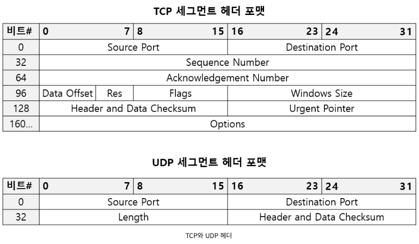

# 1. 개요

---

## 네트워크
- 여러 장치들이 서로 정보를 주고받을 수 있는 통신망
- LAN(Local Area Network)과 WAN(Wide Area Network) 등으로 구분할 수 있고 각 LAN은 인터넷을 통해 다른 LAN으로 연결됨
- 인터넷에 접속되기 위한 인프라를 사용하기 위해서는 ISP(Internet Service Provider)를 통해야 함

### 구성요소
- 노드
  - 종단 시스템과 중간 네트워크 장비들이 있음
  - 메시지를 최초로 송신, 생성하는 대상
  - '주소'를 통해 위치 특정
- 메시지
  - 주고받는 정보
  - 웹페이지, 사진, 동영상, 메일 등 형태는 다양함
- 간선(통신 링크)
  - 유선 케이블
  - 무선

## 네트워크에서 주고받는 정보

### 패킷
- 현대 인터넷에서 주고받는 정보의 단위
- 구성요소
  - 헤더(header): 패킷 앞에 붙일 부가 정보
  - 페이로드(payload): 패킷에 보낼 정보
  - 트레일러(trailer): 패킷 뒤에 붙일 부가 정보

### 프로토콜
- 노드 간 정보를 주고받을 규칙이나 방법
- 헤더에 프로토콜에 해당하는 내용이 있음
  

## 네트워크 참조 모델

### OSI 모델
- 이론적인 설계에 집중된 모델
- 계층 구조
  1. 물리 계층 
  2. 데이터링크 계층 
  3. 네트워크 계층
  4. 전송 계층 
  5. 세션 계층 
  6. 표현 계층 
  7. 응용 계층

### TCP/IP 모델
- 실제 구현에 집중된 모델
- 계층 구조
  1. 네트워크 엑세스 계층 
  2. 인터넷 계층 
  3. 전송 계층 
  4. 응용 계층

### 캡슐화와 역캡슐화

> 데이터를 보낼때는 낮은 레벨로 갈 수록 계층별로 필요한 정보를 헤더에 담아서 추가하는 `캡슐화` 과정을 거치고,   
> 데이터를 받을때는 높은 레벨로 갈 수록 계층별로 필요한 정보를 헤더에서 뽑아서 사용하는 `역캡슐화` 과정을 거친다.

## 네트워크 성능

### 트래픽
- 특정 시간동안 네트워크 내 정보 흐름
### 전송 속도(Transmission Speed)
- 기대 가능한 속도
- bps(b/s, bits per second)
- Mbps(Mb/s, Megabits per second)
- Gbps(Gb/s, Gigabits per second)
### 처리율(Throughput)
- 단위 시간동안 전송되는 데이터 양
- bps(b/s, bits per second)
- Mbps(Mb/s, Megabits per second)
- Gbps(Gb/s, Gigabits per second)
### 대역폭(bandwidth)
- 네트워크 트래픽을 수용할 수 있는 용량
- 즉, 전송 매체의 두께
### 패킷 손실(packet loss)
- 송수신 과정에서 손실되는 비율(백분율로 표기함)