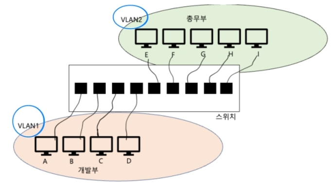

# 2. 네트워크 엑세스 계층

---

## 1) 이더넷

- 현대 (유선) LAN에서 가장 대중적으로 사용되는 기술(스펙/프로토콜)
- 물리 계층에서는 케이블, 데이터 링크 계층에서는 이더넷 프레임

### 이더넷 프레임

- 이더넷 네트워크에서 주고받는 데이터 형식
- 목적지/송신지의 `MAC` 주소(물리적 주소, 네트워크 장치(NIC)마다 할당된 고유한 주소)가 포함되어 있음

## 2) 허브와 CSMA/CD

- 물리 계층(제일 낮은 level)의 장비이며, 주소 개념이 없기 때문에 모든 포트로 정보를 내보냄
  - 때문에 MAC 주소를 이해하지 못함
- 반이중 통신(half-duplex, 송신 수신 중 하나만 가능한 통신)
  - 때문에 동시에 허브로 데이터를 전송하면 충돌 발생
  - CS(전송 중인 데이터가 있는지 확인), MA(두 개 이상의 호스트가 허브에 접근하는지 확인), CD(임의의 시간 대기 후 재전송) 등으로 충돌 해소
- 요즘은 거의 안쓰임 -> 단점을 보완하는 `스위치`

## 3) 스위치와 VLAN

- 데이터 링크 계층의 장비
- 목적지 포트로만 내보냄
- 전이중 통신(full-duplex, 송신 수신 동시 가능)

### MAC 주소 학습기능
송신지 기반으로 학습을 한다.

1. 플러딩
   - 데이터를 보낸(송신지) 포트의 MAC 주소를 기록하여 기억
   - 모든 포트로 내보낸 후 응답이 오는(수신지) 포트의 MAC 주소를 기록하여 기억
2. 포워딩과 필터링
   - 학습한 MAC 주소를 활용해서 특정 포트로만 보냄
3. 에이징
   - 특정 시간이 지나면 MAC 주소 테이블 항목을 삭제함

### VLAN

- 하나의 물리 스위치를 여러 논리적 공간으로 나누는 `스위치` 기능이 있음
- 물리적 위치에 관계없이 특정 LAN에 속할 수 있음
  - 때문에 브로드캐스트 범위가 달라지며, 트래픽 낭비를 최소화 할 수 있음
- 포트 기반 VLAN(정적 VLAN, 스위치의 포트에 특정되어 있으니) / MAC 주소 기반 VLAN(동적 VLAN, 포트랑 상관없이 호스트를 따라가기 때문에)