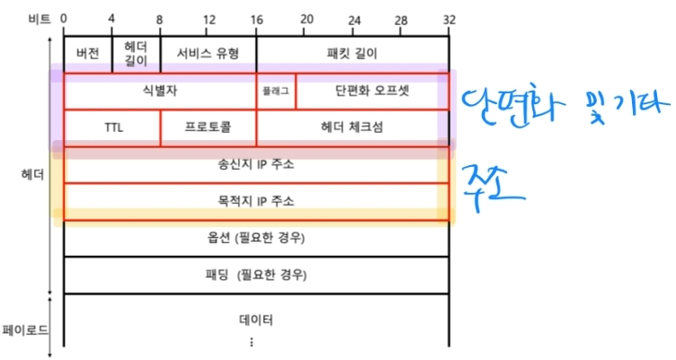
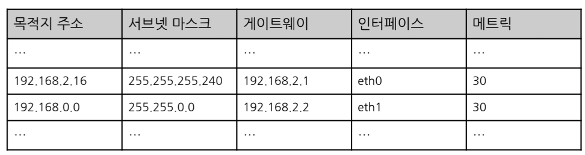
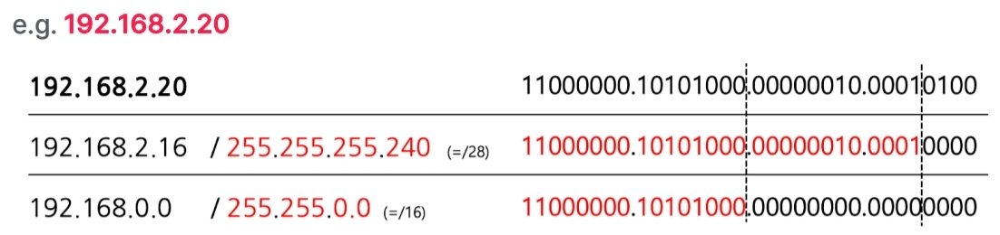

# 3. 네트워크 계층

---

## 1) IP(Internet Protocol)

- 네트워크간 통신이 가능하도록 해주는 계층. 즉, LAN을 넘어서기 위한 계층
- 때문에 `라우팅(최적의 경로로 목적지를 찾아가는 과정)`이 필요함
- 단편화가 이루어짐
  - 패킷을 쪼개서 전송되며, IP 프로토콜을 사용함

> MAC 주소로 못보내나?
> 
> 도달 경로를 파악하기가 어렵다. MAC 주소는 주민번호와 같은데, 주빈번호로 택배를 보낼 수는 없다.   
> 즉, **주소를 찾기 위한 최적화된 주소체계가 필요하다.**

### IP의 두 가지 주요 기능

1. IP 주소 지정
   - 직접 할당
   - 자동 할당 (DHCP)

    > **DHCP(Dynamic Host Configuration Protocol)**
    >
    > - 네트워크 장치에 IP 주소 및 관련 네트워크 구성 정보를 동적으로 할당하는 프로토콜
    > - 라우터에는 DHCP 서버가, IP를 할당받는 장치에는 DHCP 클라이언트가 설치되어 있다.
    > - 할당받는 장치가 네트워크에 연결되면 DHCP 서버를 찾아서 MAC 주소를 알려주면, DHCP 서버는 할당할 ip주소를 알려준다.
    > - 연결 TTL이 있으며, TTL의 50% 시점에 갱신을 진행한다.
    > - 갱신이 안되면 TTL 87.5% 시점에 새로 DHCP를 찾아서 리바인딩을 진행한다.
    > - DHCP 서버에서 네트워크 장치의 MAC 주소로 ip를 고정하여 할당할 수 있다.

2. 단편화
   - 패킷의 크기를 MTU(Maximum Transmission Unit) 이하로 유지
   - 단편화된 패킷들은 목적지에 가서 다시 재조합됨

### IPv4 헤더

- 단편화 오프셋: 첫 데이터로부터 떨어진 거리. 재조합 시 순서를 위해
- TTL(Time To Live): 패킷의 수명. 라우터를 건너 뛸 때마다(홉) 1씩 감소

### IPv4 주소

- 4바이트(32비트)로 표현하며, 한 옥텟(.)은 0~255 범위의 네 개의 십진수로 표기하는 것이 일반적임
- 기존에는 클래스풀 주소체계(A, B, C 등)를 사용했으나, 낭비되는 주소가 많았음
- 따라서 현재는 클래스리스 주소체계를 사용함
  - 서브넷 마스크로 네트워크 주소(1), 호스트 주소(0)를 표현함
    - 때문에 서브넷 마스크와 IP 주소를 `AND`연산 하면 네트워크 주소가 됨
  - 서브넷 마스크가 아니라 `CIDR` 표기도 많이 사용함 (1의 개수를 직접 표기, `192.168.100.1/30`)

### 공인 IP와 사설 IP

- 공인 IP: 인터넷에서 식별되는 고유한 주소
- 사설 IP: 인터넷에서 식별되지 않는 고유하지 않은 주소(LAN 내에서는 고유함)
  - 사설 IP 주소 대역
    - 10.0.0.0/8
    - 172.16.0.0/12
    - 192.168.0.0/16

### NAT

- 공인 IP 주소와 사설 IP 주소간의 변환 기능
- 현대에는 보통 공유기에 NAT 기능이 포함되어 있음
  - 공유기에는 NAT, 라우팅, DHCP 등의 여러 기능을 포함하고 있음

### ICMP

- IP는 `비신뢰성(패킷이 목적지까지 전달이 된다는 보장이 없음)`, `비연결형(사전 연결 수립이 없음)`의 특징을 가짐
- 이런 특성을 보완하기 위한 네트워크 계층 프로토콜
- ping이 ICMP를 활용한 대표적인 기능
- **완전히 해결하기 위해서는 결국 `전송계층`에서 이루어짐**

## 2) ARP

- (동일 네트워크 내에서) IP 주소를 이용해서 MAC 주소를 알아내는 프로토콜
  - 때문에 이 범위를 LAN 범위라고 보는 관점도 있음

1. ARP 요청: 브로드캐스트로 IP의 주인을 찾음
2. ARP 응답: IP 주인이 MAC 주소를 응답함
3. ARP 테이블 갱신: 테이블에 IP-MAC 주소 테이블 업데이트

## 3) 라우팅

- 패킷이 이동할 최적의 경로를 찾아가는 과정
- 네트워크 계층 장비인 `라우터`가 해당 기능을 수행함

### 라우팅 테이블

- 네트워크의 각 단말들과 네트워크를 구성하는 라우터들이 관리하는 목적지에 도달하기 위한 정보를 명시하는 표
- 목적지 주소, 서브넷 마스크, 게이트웨이(다음 홉), 인터페이스, 메트릭(비용) 과 같은 정보가 담겨있음
- `롱기스트 프리픽스 매치(longest prefix match)` 즉, 세부주소가 가장 가까운 곳에 패킷을 전송함
  
  - 위 라우팅 테이블을 가진 라우터에 `192.168.2.20`으로 패킷을 보내는 요청이 온다면
    
    - 가장 길게 매치되는 `192.168.2.16`으로 보내게 된다.
- `디폴트 라우트` - 합치되는 경로가 없는 경우 기본으로 내보낼 경로는 `0.0.0.0/0`으로 되어 있다.