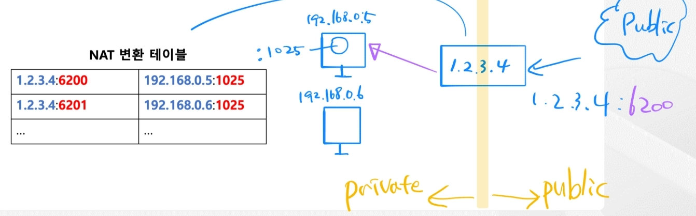
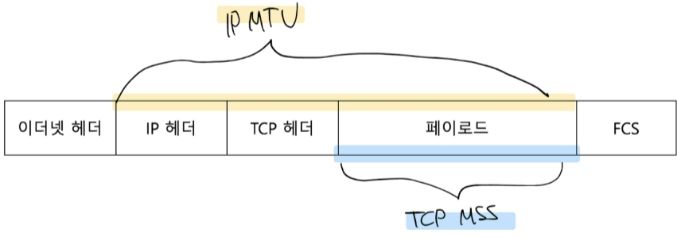
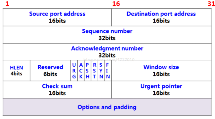
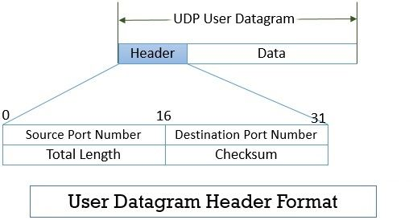
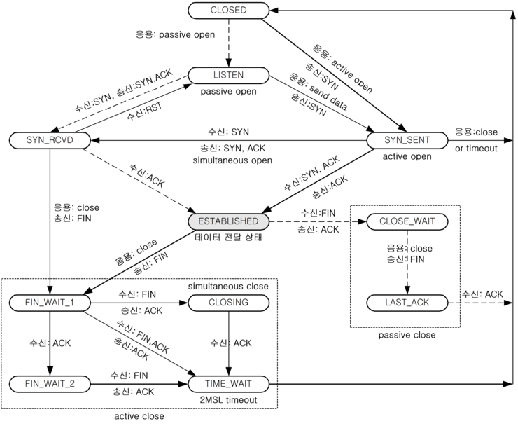
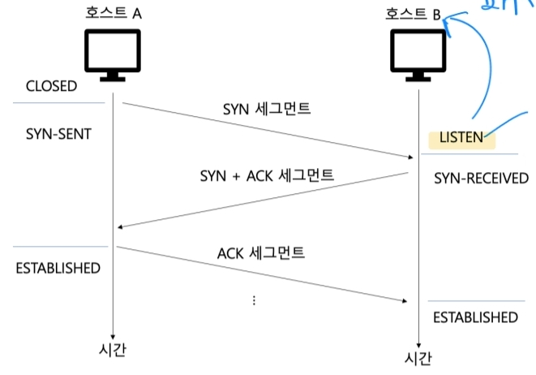
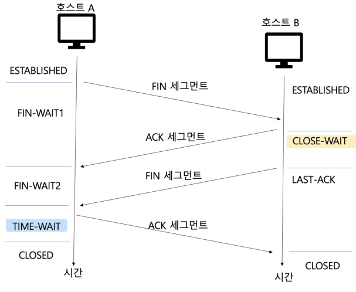
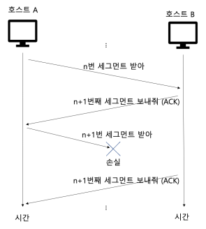
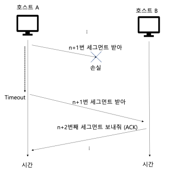
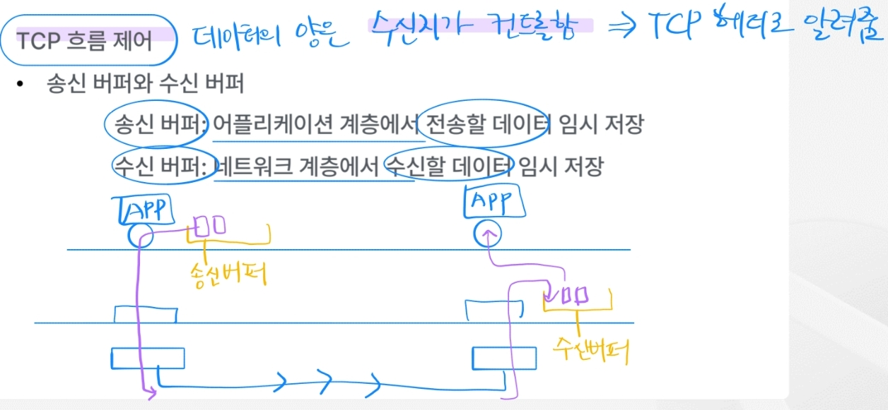

# 4. 전송 계층

---
## 주요 역할

- 응용 계층의 어플리케이션 프로세스를 식별
- 네트워크 계층의 신뢰성/연결성 확립

## 1) 포트

- 16비트로 표현 가능(65536개)
- 범위에 따라
  - Well known: 0 ~ 1023
    - 20, 21: FTP
    - 22: SSH
    - 25: SMTP
    - 53: DNS
    - 67, 68: DHCP
    - 80: HTTP
    - 443: HTTPS
  - Registered port: 1024 ~ 49151
    - 1194: OpenVPN
    - 3306: MySQL
    - 6379: Redis
    - 8080: HTTP 대체
  - Dynamic port: 49152 ~ 65535

### NAT

- 공인 IP 주소와 사설 IP 주소 간의 변환 기능
- 하나의 공인 IP로 여러 사설 IP 주소가 공유하기 때문에
  1. IP 주소 부족 문제를 해결하며
  2. 대신 포트로 애플리케이션을 식별함
- NAT 변환 테이블 활용
  

### 포트번호 확인

`netstat`($ sudo apt install net-tools)
  - `-n`: 숫자 형태
  - `-t`: TCP
  - `-p`: PID
  - `-u`: UDP

## 2) TCP와 UDP

### MSS(Maximum Sagment Size)와 MTU(Maximum Transmission Unit)

### TCP 세그먼트 구조

- 출발지&목적지 포트: 애플리케이션 식별
- 순서 번호: 송수신되는 세그먼트 데이터 첫 바이트에 부여되는 번호 `-> 누락없이 처리하기 위함`
- 확인 응답 번호: 순서 번호에 대한 응답. 즉, 다음으로 수신받길 기대하는 바이트 번호 `-> 누락없이 처리하기 위함`
- 제어 비트: ACK(세그먼트 승인), SYN(연결 수립), FIN(연결 끝), RST(연결 리셋)...
- 윈도우: 한 번에 수신 받고자 하는 양

### UDP 세그먼트 구조

- IP 패킷을 감싸는 정도로, 애플리케이션 식별 및 길이와 체크섬(데이터의 오류확인용)만 있음
- TCP에도 포함된 정보들이며, 전송 보장과 관련된 필드는 없음
- DNS, DHCP 등은 UDP 프로토콜로 처리되고 있음
- `HTTP/3`는 UDP 기반으로 하며, 빠른 성능으로 각광받고 있음 

## 3) TCP 연결

### 3-Way handshake

- 

## 4) TCP 상태

- TCP는 `Stateful Protocol`이다.

### 가능한 상태 목록

- CLOSED: 아무런 연결이 없는 상태
- LISTEN(패시브 오픈 호스트): 연결 대기(SYN 대기)
- SYN-SENT(액티브 오픈 호스트): SYN 전송
- SYN-RECEIVED(패시브 오픈 호스트): SYN 수신
- ESTABLISHED: 연결 활성화

- FIN-WAIT-1(액티브 오픈 호스트): FIN(연결 해제 요청) 후 대기 상태
- CLOSE-WAIT(패시브 오픈 호스트): FIN 세그먼트에 대한 ACK 세그먼트 전송 후 대기 상태
- FIN-WAIT-2(액티브 오픈 호스트): ACK 세그먼트를 받은 후 대기 상태
- CLOSING(액티브 오픈 호스트): 상대 FIN 세그먼트에 ACK 세그먼트를 보냈지만, 자신의 FIN 세그먼트에 대한 ACK 세그먼트를 받지 못한 상태(보통 동시에 연결 종료 요청을 한 경우 발생)
- LAST-ACK(패시브 오픈 호스트): FIN(연결 해제 요청) 후 대기 상태
- TIME-WAIT(액티브 오픈 호스트): 연결 종료 전 일정 시간 대기하는 상태. 마지막 ACK 세그먼트 유실을 대비하고, 또 다른 연결과정에서의 패킷 혼선을 방지함

## 5) TCP 재전송 기능

### 재전송 기반의 오류 제어

- 잘못 전송된 경우 재전송하여 오류 제어
- 인지
  - 중복 ACK 세그먼트 수신
  
    
  - 타임아웃 발생
  
    
- ARQ(자동 재전송 요구)
  - Stop-and-Wait
    - 전송하고 확인하고, 전송하고 확인하고,,,,
  - Go-Back-N
    - 여러 세그먼트를 한 번에 보내다가 특정 세그먼트에 대한 응답이 안오면(타임아웃) 그 부분으로 돌아가서 다시 보냄
  - Selective Repeat
    - 보내는 세그먼트 각각 확인하여 응답이 안오면(타임아웃) 그 세그먼트만 재전송
    - 때문에 보내는 호스트에서 확인할 것이 많아짐
- 빠른 재전송
  - 타임아웃 전이라도 데이터 요청을 특정횟수 이상 받으면 즉시 보냄

### 흐름 제어

- 수신 호스트가 받을 수 있는 만큼만 받기(버퍼 크기 체크하여)
- 수신 호스트가 송신 호스트에게 TCP 헤더의 `Window` 필드로 알려줌

### 혼잡 제어

- 보낼 수 있는 상황에서만 보내기(라우터 및 공유기 등의 과부하로 `혼잡 붕괴` 상황을 막기 위해)
- 확실한 양이 아니기 때문에 송신지에서 어림잡아 컨트롤하며, 수신지는 알 필요가 없는 정보라 TCP 헤더이 포함되어있지 않음
