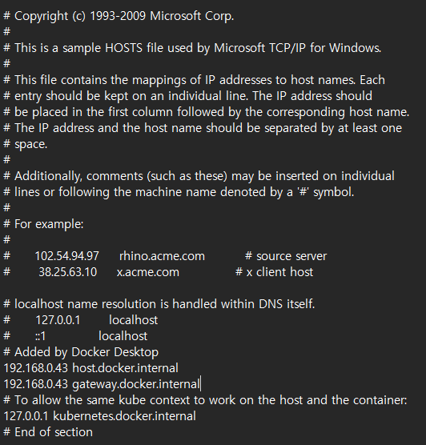
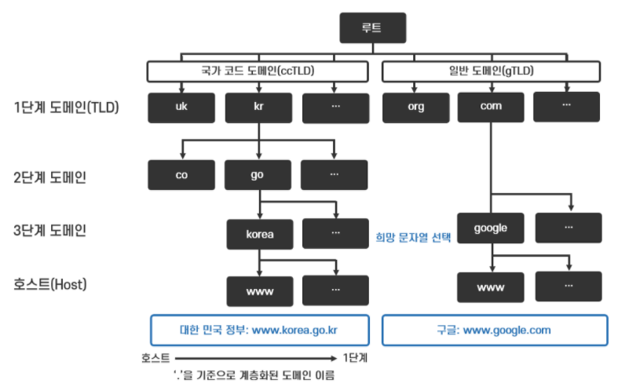
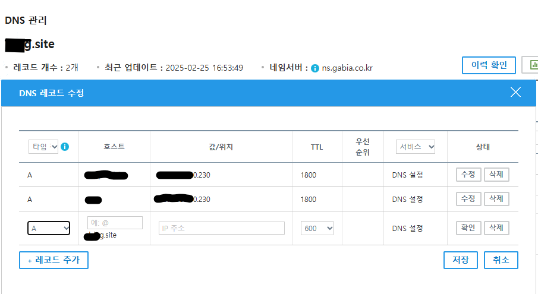
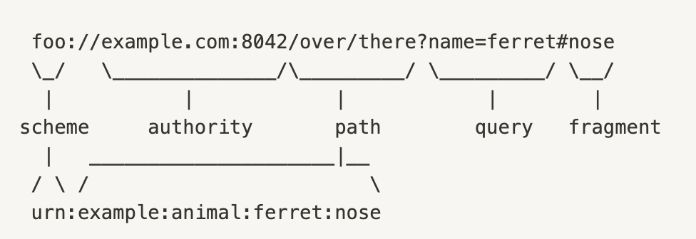
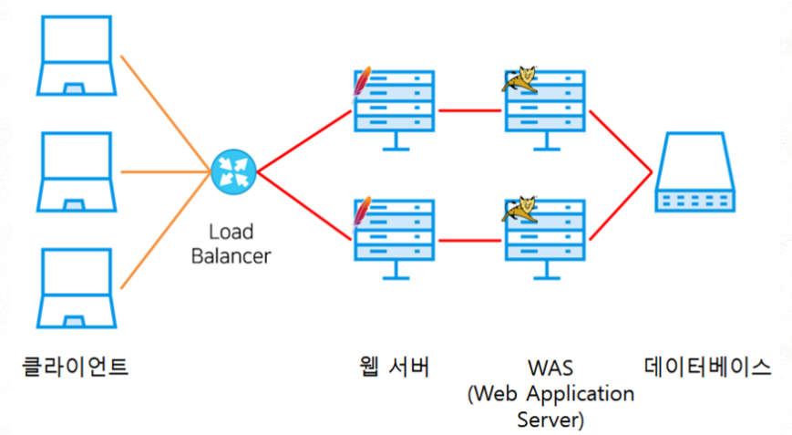

# 5. 응용 계층

---

## 1) DNS(Domain Name Server)

- 사람이 기억하기 쉬운 도메인 이름과 호스트(IP)를 특정지을 주소를 매핑하는 정보를 가진 서버
- IP 주소
  - 기억하기 어려우며
  - 변경될 수 있음

### host 파일
- 개인이 가진 매핑 테이블
- OS마다 위치가 다름
  - Unix, Unix-like, Mac OS: `/etc/hosts`
  - Windows: `%SystemRoot%\System32\drivers\etc\hosts`
    
    - 내 컴퓨터의 `hosts` 파일인데, Docker Desktop을 설치했더니 `192.168.0.43`과 `host.docker.internal`이 매핑되었다. 즉, 내 호스트는 `host.docker.internal`로 찾아가는게 `192.168.0.43`으로 찾아가는 것과 동일하다는 것이다.

### 계층적 도메인 구조



- 루트 도메인은 아무것도 없는 `/`, 전 세계에 몇 대 없음
- 최상위 도메인은 `TLD, Top-Level-Domain`이라고 부름
  - 일반 도메인은 `.com`, `.org`, `.net`, `.edu`, `.gov` 등이 있음
  - 국가별로 국가 도메인이 있으며, 한국은 `kr`

### 서브 도메인 (하위 도메인)

- `wikipedia.com` -> `ko.wikipedia.com` 에서 `ko`가 서브 도메인

### Authoritative DNS 서버

- 찾고자 하는 도메인의 IP 주소를 저장하는 최종 서버. 즉, 내가 원하는 IP 주소가 튀어나오는 서버

### local DNS 서버(DNS Resolver)

- 클라이언트가 가장 먼저 찾는 DNS 서버
- 해당 서버가 계층적 도메인 서버에 질의해서 호스트에 알려주는 역할을 함
  - 반복적 질의, 재귀적 질의 두 방법 중 한 방법으로 질의하나, 결론적으로 local DNS 서버가 IP를 주는 것은 동일함
- 명시적으로 설정도 가능하며(Public DNS, e.g. 8.8.8.8 -> google DNS server)
- 자동 설정도 가능(보통 ISP에서 제공함)

### DNS 레코드

- DNS 서버가 저장하고 있는 데이터
- A 레코드: 도메인에 대한 IPv4 주소 (도메인과 ip주소를 일대일로 매칭)
- AAAA 레코드: 도메인에 대한 IPv6 주소
- CNAME 레코드: 도메인에 대한 별칭
- NS 레코드: 네임 서버 주소
- SOA 레코드: 도메인에 대한 관리자 정보


- 위 사진은 내가 구매하여 사용중인 도메인이며, 가비아에서 DNS 관리를 해줌
- 타입은 A, CNAME 등등을 지정할 수 있으며, `호스트.xxxg.site`라는 곳으로 접속을 하면 `값/위치`에 해당하는 ip를 네임서버(ns.gabia.co.kr)이 전달해주는 것이라고 이해하면 됨
- TTL은 캐싱값

## 2) 자원과 자원의 식별

- 자원: 네트워크로 주고받는 정보(파일, 이미지, HTML, XML, JSON...)

### URI(Uniform Resource Identifier)

- 자원 식별자
- URL: 위치 기반 식별(Locator)
- URN: 이름 기반 식별(Name)



- scheme: 프로토콜 이름 명시
- authority: [userinfo"@"]host[":"port]
  - 사용자 이름은 생략 가능
  - 포트 번호는 생략하면 기본 포트로 (web -> 80, ftp -> 22 등)
- path: 자원 경로
- query: 파라미터
- fragment: HTML의 북마크 기능, 서버에 전달되지는 않음

## 3) 웹 서버와 웹 애플리케이션 서버

- 웹 서버는 `정적(언제, 어디서, 누가 봐도 변하지 않는)`인 자원을 서빙하고
- 웹 애플리케이션 서버는 `동적(언제, 어디서, 누가 보느냐에 따라 변하는)`인 자원을 서빙함

### 현대 웹 서비스 구성



- 역할을 나누어 과도한 부하가 있는 부분을 scale-out 하기 편하도록 구성
- 웹 서버(그림에서는 더 앞단의 Load Balancer) 등의 프록시를 두어 WAS의 노출을 없애 보안 상 이점을 가지고 옴

## 4) HTTP

- 요청-응답 기반 클라이언트-서버 구조 프로토콜
- 미디어 독립적인 프로토콜
  - HTML, 이미지, JSON, XML, 영상 등
- 비연결성 프로토콜
  - TCP는 연결성
- Stateless 프로토콜
  - 한 서버에 종속될 수 있기 때문
- 지속 연결 프로토콜
  - Keep-Alive 로 하나의 TCP 연결에서 여러 개의 HTTP 요청을 주고 받을 수 있음

### HTTP 대표적인 헤더

- Host: 요청 호스트에 대한 호스트명 + 포트 정보
- Date: 메시지 생성 시간
- Referer: 직전에 머물렀던 URL
- User-Agent: 클라이언트 소프트웨어(웹에서는 브라우저 명칭과 정보)
- Server: 서버 소프트웨어 명칭과 정보
- Connection: keep-alive일 경우 keep-alive 명시 (HTTP 1.1 이상)
- Location: 리다이렉트 시 이동할 경로 (3xx 코드와 함께) 
- Content-Type: HTTP 요청 및 응답에서 사용될 컨텐츠의 유형. MIME 타입으로 명시 (<type/subtype> 형식으로)
  - `*/*` 
  - text/html; charset=utf-8
  - application/json
  - image/png
  - text/plain
  - application/xml
  - 등
- Content-Encoding: 데이터의 인코딩/압축 방식
- Content-Length: 데이터의 바이트 단위 길이
- Content-Language: 데이터의 언어
  - en, en-US
  - ko, ko-KR

## 5) 네트워크 캐시

- 서버의 지연을 줄이기 위해서 웹 페이지, 이미지 등의 자원 `사본`을 임시 저장하는 웹 기술
  - 사본이기 때문에 항상 최신화 sync를 주의해야함
  - 캐시되는 위치는 클라이언트 브라우저 혹은 캐싱 서버
- HTTP의 응답 헤더에서는 
  - cache-control 헤더로 캐시 기능을 알림
    - max-age=숫자(초) 캐시한 자원의 지속 시간
    - no-cache: 캐시 가능한 자원이나, 항상 origin 서버에 검증하기
    - no-store: 캐시하면 안됨!
  - Last-Modified 헤더를 통해서 해당 자원이 언제 마지막으로 변경되었는지 알림

### 변경 시간 기반 캐시

1. request: 해당시간 이후로 바뀐게 있는지 확인하는 요청
```http request
GET /example.jpg HTTP/1.1
Host: www.example.com
If-Modified-Since: Wed, 10 Aug 2025 12:00:00 GMT
```

2. response: 안바뀌었으니 캐시로 리다이렉트하라는 응답
```http request
HTTP/1.1 304 Not Modified
Date: Thu, 11 Aug 2025 10:00:00 GMT
```

### 자원 식별자 기반 캐시

1. response: 자원 식별자 `Etag`를 함께 응답
```http request
HTTP/1.1 200 OK
Date: Thu, 11 Aug 2025 10:00:00 GMT
Content-Type: text/css
Etag: "abc123"
Cache-Control: max-age=100
Content-Length: 1234
```

2. request: `If-None-Match` 헤더로 Etag 식별자가 바뀌었는지 확인
```http request
GET /example.css HTTP/1.1
Host: www.example.com
If-None-Match: "abc123"
```

3. response: 안바뀌었으니 캐시로 리다이렉트하라는 응답
```http request
HTTP/1.1 304 Not Modified
Date: Thu, 11 Aug 2025 10:00:00 GMT
```

## 6) 쿠키

- 서버로부터 받은 정보를 클라이언트 측(웹 브라우저)에 임시로 저장하는 `이름=값` 형태의 데이터
- 유효 기간이 있음
  ```http request
  Set-Cookie: expires=Wed, 10 Aug 2025 12:00:00 GMT
  혹은
  Set-Cookie: max-age=1000 
  ```
- 쿠키를 전송할 `Domain`과 `Path`가 정해져 있어서 모두 일치하는 경우만 서버로 전송함
- 서버가 `Set-Cookie` 헤더로 전달한 내용을 클라이언트가 받아서 저장함
- 탈취 가능성이 항상 있기 때문에 민감한 정보를 담으면 안됨
- 보안 기능
  1. Secure: HTTPS인 경우에만 전송
  2. HTTPOnly: js에서 document.cookie로 접근이 불가능하여 XSS 공격 방지

> 쿠키와 세션
> 
> 쿠키의 저장/관리 주체는 클라이언트
> 세션의 저장/관리 주체는 서버 -> 세션 ID 자체는 클라이언트가 가지고 있어서 사용할 수 있지만, 그 키에 해당하는 실제 값을 탈취당하지는 않는다.

## 7) 컨텐츠 협상

- 클라이언트가 원하는 컨텐츠를 받을 수 있도록 서버에게 부탁하는 기능
- 컨텐츠 타입, 언어, 인코딩 방법 등을 클라이언트에게 맞추어 제공
- `Accept(-X)` 헤더 이용
  ```http request
  Accept: text/html, application/xml, application/json;q=0.9, ...
  ```
  - q 값을 통해서 우선순위를 매길 수 있음 (1이 제일 선호)