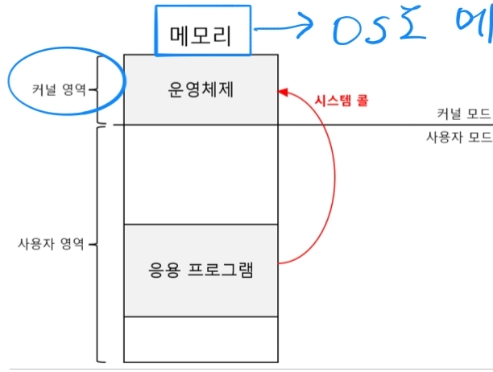

# 1. 개요

---

## 운영체제란?

- 컴퓨터 자원(리소스)들을 관리하고 프로세스에 할당하는 특별한 프로그램
- 때문에 운영체제가 동작하면 메모리에도 `커널 영역`이라는 특별한 곳에 할당됨
- 운영 체제에는 `커널(Kernel)`이라는 핵심부가 있으며, 보통 CS나 흔히 이야기하는 운영체제는 바로 이 커널 부분을 이야기하는 것임
- 모든 응용 프로그램은 운영체제를 통해서만 컴퓨터 자원(리소스)에 접근할 수 있음

## 시스템 콜

- 운영체제 서비스를 제공받기 위해 커널 모드로 전환하는 것
  - 응용 프로그램은 컴퓨터 자원(리소스)를 사용하기 위해 운영체제의 코드를 실행해야 하기 때문
- 소프트웨어 인터럽트임
- 짧은 코드라도 수 많은 시스템 콜이 발생함

### 응용 프로그램의 시스템 콜 사용 순서
1. 시스템 콜(커널모드 전환)
2. 기존 작업 백업 
3. 운영체제 코드 실행
4. 시스템 콜 복귀(사용자모드 전환)
5. 기존 작업 재개

### 리눅스의 대표적인 시스템 콜
1. open - 파일(파일, 디렉토리, 장치, 소켓 등)을 여는 시스템 콜
2. close - 파일 관련 자원 해제
3. read - 파일 데이터를 읽어들임
4. write - 파일 데이터를 씀
5. fork - 프로세스를 복제하여 자식 프로세스 생성
6. exec - 현재 프로세스의 주소 공간을 새로운 프로세스로 덮어쓰기

## 운영체제의 핵심 서비스

1. 프로세스 관리
2. 자원 관리 접근 및 할당
   - CPU
   - 메모리
   - 보조기억장치 & 입출력장치
3. 파일 시스템 관리