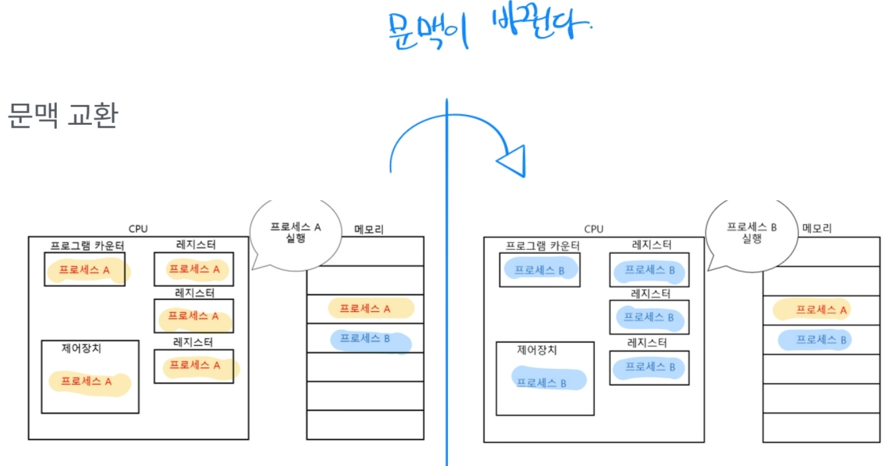
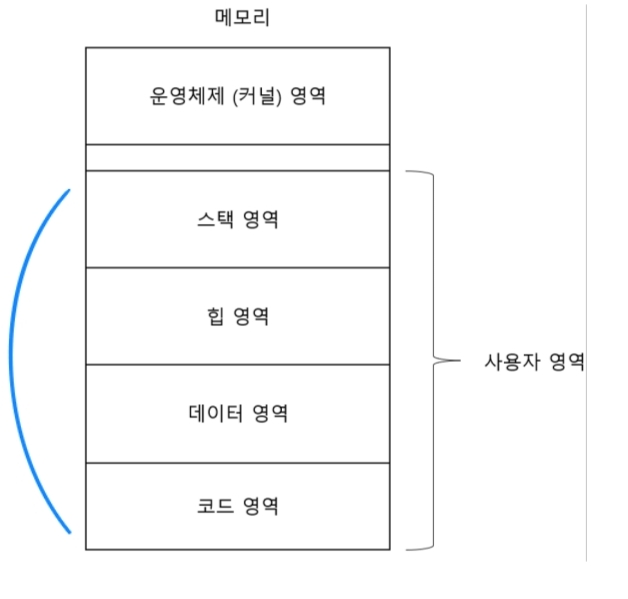
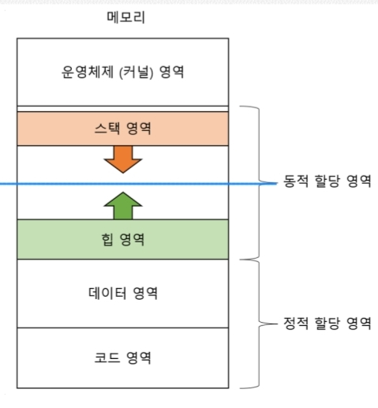
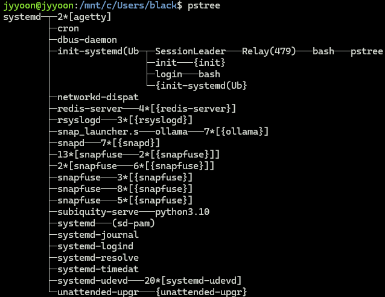
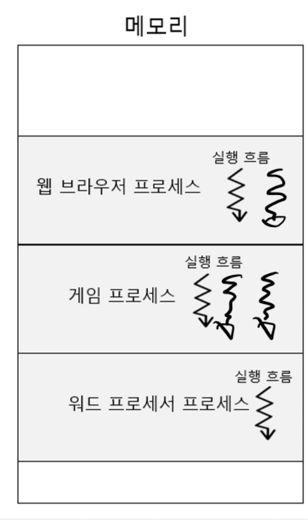
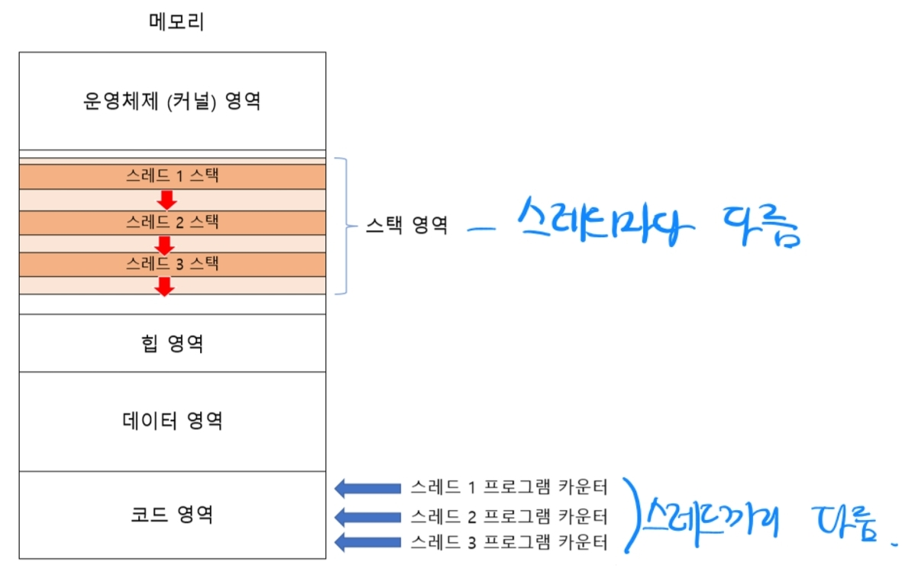
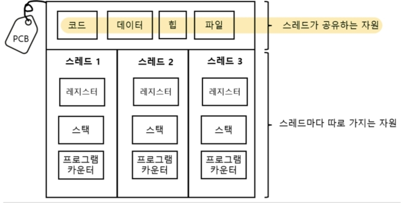

# 2. 프로세스와 스레드

---

## 프로세스란?

- 실행중인 프로그램
- `포그라운드 프로세스` - 지금 상호작용중인 프로세스
- `백그라운드 프로세스` - 데몬(사용자와 상호작용 안하는 프로세스), 대기중인 상호작용 프로세스

## 프로세스 제어 블록(PCB)

- 프로세스 관리를 위한 자료구조
- 프로세스 식별이 가능하며, 이는 메모리 내에 '커널 영역'에 할당되어 있음

### PCB에 있는 정보

- `PID` 프로세스 아이디
- `스케줄링 정보` 우선순위 포함
- `메모리 정보`
- `사용한 파일 정보`
- `입출력장치 정보`
- 등 (실제로는 더 다양함)

## 문맥 교환 (Context Switch)

- 보통 CPU(코어) 갯수보다 실행되는 프로세스가 훨씬 많음
- 컴퓨터 자원은 제한적이기 때문에 프로세스를 여러개 돌아가면서 실행을 하게 되는데, 
이 때 실행 재개를 위해 기억해야할 정보가 담겨있는 것이 `문맥(Context)` 이며, 이 데이터들이 바뀌는 것이 `문맥 교환(Context Switch)` 이다.



- 이 교환에도 비용(오버헤드)가 존재함

## 메모리의 사용자 영역 데이터

- 커널 영역에는 PCB 정보가 할당되어 있다. 그렇다면, 사용자 영역에는?



### 코드 영역(텍스트 영역)
- 실행 가능한 코드; 기계어로 이루어진 명령어
- Read-Only!

### 데이터 영역
- 프로그램이 실행되는 동안 유지할 데이터(e.g. 전역 변수 등)

### 힙 영역
- 사용자(개발자)가 직접 할당 가능한 공간
- 메모리 관리가 필요할 수 있음 (사용하고 해제 안하면 메모리 누수가 남)

### 스택 영역
- 임시로 저장되는 영역 (e.g. 매개 변수, 지역 변수 등)



## 프로세스 상태

- `생성 상태(new)`
- `준비 상태(ready)` 당장 시작 가능하나 자원 할당을 못 받은 상태
- `실행 상태(running)`
- `대기 상태(blocked)` 당장 실행이 불가능한 상태 (주로 입출력장치에 작업을 요청해놓은 상태)
- `종료 상태(terminated)`

## 프로세스가 생성되는 원리

- fork-exec (시스템 콜)
- fork
  - 자식프로세스로서 생성하고 PCB에 부모 프로세스 ID를 넣어둠
  - 메모리에서 사용자 영역 데이터는 모두 같음(복제니까)
- exec
  - 현재 실행되어야 할 프로세스 데이터들로 사용자 영역 데이터가 바뀜(실제로 다른 프로세스가 실행되어야 하니까)
  - 즉, 새로운 코드로 덮어쓰기

### 프로세스의 계층적 구조

- 리눅스, 유닉스, 맥OS 등은 프로세스가 계층적 구조를 가진다.
  

> 아래와 같이 c언어로 작성된 코드를 실행해보면
> ``` syscallex4.c
> #include <stdio.h>
> #include <unistd.h>
> 
> int main() {
>   pid_t pid, ppid;
> 
>   pid = getpid(); // 내 프로세스 아이디 가져옴
>   ppid = getppid(); // 내 부모 프로세스 아이디 가져옴
> 
>   printf("Process ID: %d\n", pid);
>   printf("Parent Process ID: %d\n", ppid);
> 
>   return 0;
> }
> ```
>
> ```shell
> $ ./syscallex4
> Process ID: 4219
> Parent Process ID: 3042 <-- 해당 코드를 실행한 bash 프로세스를 복제하여 자식 프로세스를 만든 후 새로운 프로세스로 덮어쓰는 작업을 했다는 뜻
> ``` 
> ```shell
> # bash 프로세스 확인
> $ ps
> ```
> |PID|TTY|TIME|CMD|
> |---|---|---|---|
> |3042|pts/0|00:00:00|bash|
> |4220|pts/0|00:00:00|ps|
> -> 결과를 보면 ps도 프로세스로 생성되었다는걸 알 수 있다. 이 역시 bash가 부모 프로세스였을 것이다.

## 스레드란? (SW 관점에서의)



- 프로세스를 구성하는 실행 흐름의 단위
- 각 스레드별로 ID, 프로그램 카운터, 레지스터, 스택을 가짐



## 멀티 프로세스와 멀티 스레드

- 주된 차이점: `자원 공유 여부`



- 물론, 프로세스간 통신(`IPC; Inter-Process Communication`)을 통해서 프로세스 간에도 자원 공유하도록 할 수 있다.
  - 공유 메모리를 통한 통신
  - 파이프를 통한 통신
  - 네트워크 소켓을 통한 통신