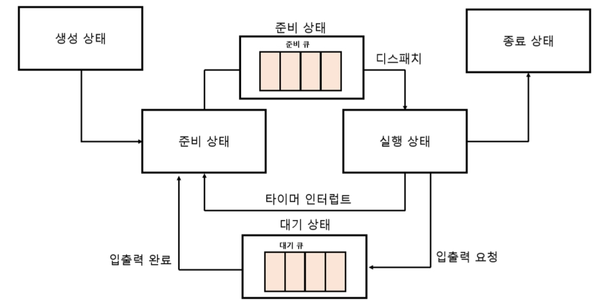

# 3. CPU 스케줄링

---

모든 프로세스(및 스레드)는 실행되기 위해 자원을 필요로 한다.
이를 `잘` 배분하기 위한 방법으로 운영체제는 `CPU 스케줄링` 알고리즘을 가지고 있다.

## 프로세스 우선순위

- PCB에 저장된 데이터 중 하나
- 우선순위가 높으면 빨리 처리하고, 낮으면 늦게 처리하는 식으로 관리함
- `$ ps -el` 명령어를 통해 확인 가능하며, `PRI`, `NI`로 볼 수 있다. (낮을 수록 우선순위 높음)
- 보통 `I/O bound process`들이 우선순위가 높고 `CPU bound process`들이 우선순위가 낮다.
  - `I/O` 작업들은 연산 필요가 많지는 않고, 대기 시간이 길기 때문에 빨리 처리해주고 I/O 대기시간동안 다른 작업을 처리하는 식으로 효율을 높인다.

## 스케줄링 큐

- 프로세스들의 요구사항을 일목요연하게 관리하는 구조로 사용함
- 준비 큐와 대기 큐를 사용하여 관리함

## 스케줄링 알고리즘

1. 선입 선처리 스케줄링
2. 최단 작업 우선 스케줄링
3. 라운드 로빈 스케줄링
4. 최소 잔여 시간 우선 스케줄링
5. 우선순위 스케줄링
   - 범용적으로 사용
   - 아사 현상(우선순위가 낮은 프로세스 실행이 계속 뒤로 밀리는 현상) -> 에이징(밀리면 우선순위 하나씩 높이는 처리방법)
6. 다단계 큐 스케줄링
7. 다단계 피드백 큐 스케줄링

이런 방법들이 있다- 정도로 이해하고 넘어간다..

