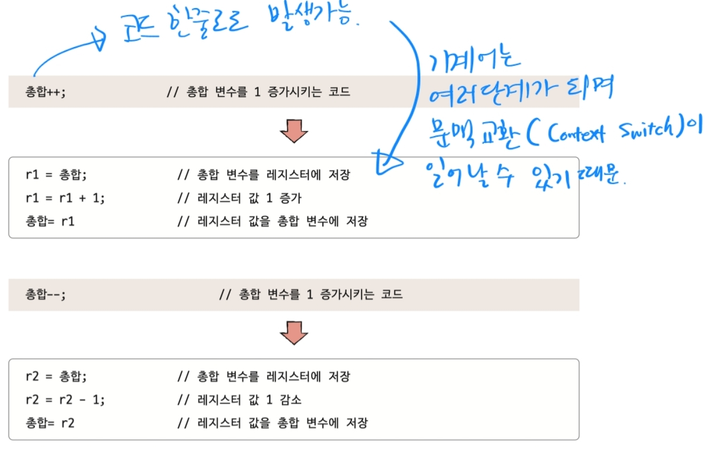

# 4. 동기화와 교착상태

---

> 한정된 컴퓨터 자원에서 많은 작업을 하기 위해서 프로세스와 스레드는 동시다발적으로 실행된다.
> 실행 순서와 자원의 일관성을 보장할 필요가 있다.

## 동기화란

- `실행 순서 제어` 올바른 순서로 프로세스 실행
- `상호 배제` 동시에 접근해서는 안되는 자원에 하나만 접근

## 공유자원과 임계구역

- `공유자원` 공동의 자원(e.g. 파일, 전역 변수, 입출력장치 등)
- `임계구역` 동시에 접근하면 문제가 발생할 수 있는 공유 자원에 접근하는 코드범위
  - `레이스 컨디션` 임계 구역을 동시에 실행하여 자원의 일관성이 깨지는 현상
  

## 동기화 해결의 세 가지 원칙

1. 상호 배제
   - 한 프로세스가 임계 구역이 진입했다면 다른 프로세스는 대기해야 함
2. 진행
   - 어떤 프로세스도 임계 구역에 진입하지 않았다면 진입이 가능해야 함
3. 유한 대기
   - 한 프로세스가 임계 구역에 진입을 위해 대기하고 있다면 언젠가는 진입이 가능해야 함

## 뮤텍스 락 (Mutex Lock)

- 상호 배제를 위한 동기화 도구
- 공유 자원이 하나일 경우를 상정함

### 뮤텍스 락의 구성
- 자물쇠: 프로세스들이 공유하는 전역변수 lock
- 잠그기 함수 (자물쇠 상태 확인 포함)
  ```
  acquire() {
    while (lock == true) <-- 바쁜 대기 (자물쇠 상태 확인)
    lock = true
  }
  ```
- 열기 함수
  ```
  release() {
    lock = false;
  }
  ```
  
### 뮤텍스 락 적용
```
aquire()

/*
임계구역
*/

release()
```

## 세마포(semaphore)

- 상호 배제 및 실행 순서 제어를 위한 동기화 도구
- 공유자원이 여러 개 있을 경우도 동기화 가능

### 세마포의 구성
- 변수 S: 공유 자원의 개수 (진입 가능한 프로세스 개수)
- 대기 함수
  ```
  wait() {
    while ( S <= 0 )
    S--
  }
  ```
- 진입 신호 함수
  ```
  signal() {
    S++
  }
  ```

### 세마포 적용

```
wait()

/*
임계구역
*/

signal()
```

### 세마포 개선 - 바쁜대기 개선

- 프로세스 상태 전이를 활용하여 무한 반복확인 낭비 줄이기
- 대기 함수 개선
  ```
  wait() {
    S--;
    if ( S < 0 ) {
      add this process to Queue; // 해당 프로세스 PCB를 세마포 큐에 삽입
      sleep(); // 대기 상태로 접어들기
    }
  }
  ```
- 진입 신호 함수 개선
  ```
  signal() {
    S++;
    if ( S <= 0 ) {
      remove a process P from Queue; // 세마포 큐에 있는 프로세스 제거
      wakeup(p); // 프로세스를 대기상태에서 준비상태로 만들기
    }
  }
  ```
  
### 세마포의 실행순서 동기화

- `먼저 실행`할 프로세스 `뒤`에 `signal()`
- `나중에 실행`할 프로세스 `앞`에 `wait()`
- 이러면 자연스럽게 나중에 실행할 프로세스는 signal이 올때가지 wait으로 기다리게 되며 실행순서가 동기화 된다.

## 조건변수와 모니터

- 기존 동기화 도구(뮤텍스 락, 세마포)는 개발자의 실수의 여지가 있음
- 공유 자원에 접근하기 위한 인터페이스를 따로 두어 인터페이스를 `통해서만` 접근하도록 함 -> 상호 배제
- 여러 프로그래밍 언어에서 제공함

### Java에서 모니터를 활용하는 방법

- `synchronized`

```java
public class Main {

  List<String> nameList = new ArrayList<>();

  public void addName(String name) {
    synchronized (this) {
      lastName = name;
      nameCount++;
    }
    nameList.add(name);
  }
}
```

## 교착상태(Deadlock)

- 서로의 자원을 필요로하여 무한 대기하고 있는 상태

### 교착 상태 발생 조건

1. 상호 배제: 동시에 자원 사용이 불가능한 경우
2. 점유와 대기: 자원을 할당받은 채 다른 자원의 할당을 기다리는 경우 
3. 비선점: 강제로 자원을 빼앗을 수 없는 경우
4. 원형 대기: 자원을 원형으로 대기할 경우

-> 이러한 조건이 만족하면 교착상태로 빠질 수 있다.

### 교착 상태의 예방

- 위 네 가지 중 하나를 없애 교착 상태 발생 가능성을 없애는 것
- 여러 부작용이 따름
  - 상호 배제를 하지 않도록 하거나 비선점 조건을 없애는 것을 모든 자원에 적용할 수 없음
  - 점유와 대기 조건을 없애면 CPU 자원 활용률이 매우 떨어짐
  - 원형 대기 조건은 자원에 번호를 매기면 되나, 모든 자원에 번호를 매길 수 없음

### 교착 상태의 회피

- 교착 상태 가능성을 판단하는 알고리즘(은행원 알고리즘)을 통해 회피

### 교착 상태 검출 후 회복

- 선점을 통한 회복
- 프로세스 강제 종료를 통한 회복

> 위와 같은 방법들로 교착 상태 문제를 해결해 갈 수 있다.