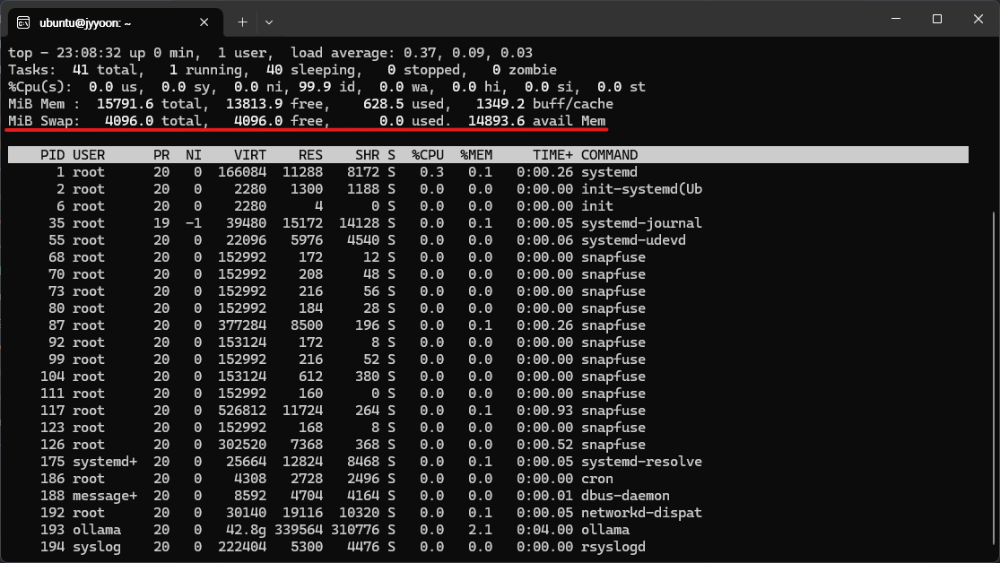
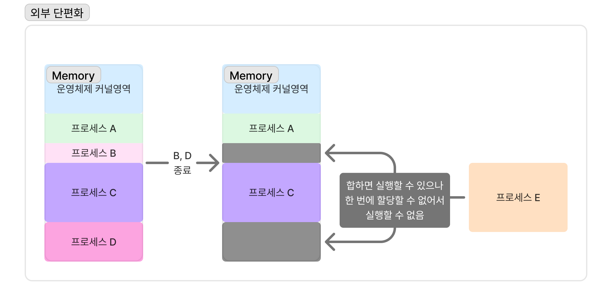
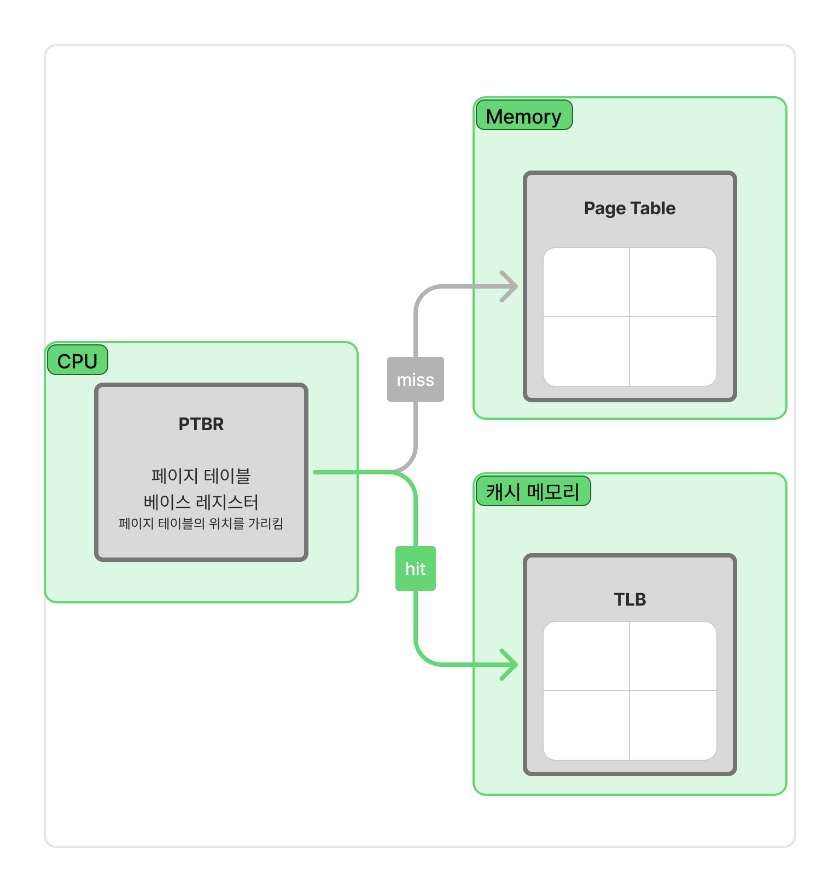

# 5. 가상 메모리 관리

---

> 현대 메모리 관리에서는 1차 메모리(ex, RAM)보다 큰 프로세스들을 동시에 실행할 수 있도록 보조기억장치(ex, SSD, HDD 등)의 일부를 메모리로 활용한다.
> 
> 이 공간을 묶어서 `가상메모리`라고 한다.

## 페이징과 페이지 테이블

### 스와핑

- 프로세스를 보조기억장치의 `스왑 영역`으로 보내고 당장 필요한 프로세스를 적재하는 메모리 관리기법
- 스왑영역 확인
    ```shell
    $ top
    ```
    
    ```shell
    $ free -h
    ```
    
- 현재 1차 메모리의 가용 크기보다 더 큰 크기의 프로세스를 실행할 수 있음!

### 연속 메모리 할당

- 프로세스를 메모리에 연속적으로 배치하는 방식
- **외부 단편화**를 초래함


### 페이징


- 물리 메모리 -> `프레임(frame)` 단위로 나눔
- 프로세스    -> `페이지(page)` 단위로 나눔
- 페이지를 프레임에 매핑하는 메모리 관리 방식
- **내부 단편화**가 발생함

### 페이지 테이블



- 프레임과 페이지의 매핑정보로써 프로세스마다 테이블이 있음
- 정말 **자주 접근**해야하기 때문에 `TLB(Translation Look-aside Buffer)`이라고 하는 캐시 메모리에 적재
  - 페이지 테이블 위치는 CPU의 `PTBR(Page Table Base Register)`에 있음
- 테이블 내에 정보
  - 유효 비트(valid bit) - 이 페이지가 메모리에 있는지 확인
    - 보조기억장치에 있을 경우 -> `페이지 폴트(page fault, 인터럽트)`
  - 보호 비트(protection bit) - 페이지 권한
  - 참조 비트(reference bit) - 접근한 적 있는지
  - 수정 비트(modify bit / dirty bit) - 쓰기 작업(데이터 변경 작업)을 한 적이 있는지 -> flush 기준
- 페이지 테이블은 프로세스가 클수록 크기가 크기 때문에 `계층적 페이징`을 통해서 메모리에 적재할 페이지 테이블의 크기를 줄일 수 있음
  - 페이지 테이블의 페이지 테이블

## 요구 페이징, 스래싱

### 요구 페이징

- 페이지 폴트가 발생하면 그 때 필요한 페이지를 메모리에 적재하는 기법

### 스래싱

- 프로세스 실행 시간보다 페이징에 더 많은 시간이 소요되는 문제
- 페이지-인 / 페이지-아웃 에 대한 시간이 더 많이 걸리는 상황

### 페이지 교체 알고리즘

- 페이지 폴트는 적게 발생할수록 좋다
- 하드웨어 관점 -> 메모리를 크게 하면 되지
- 소프트웨어 관점 -> `알고리즘!`

