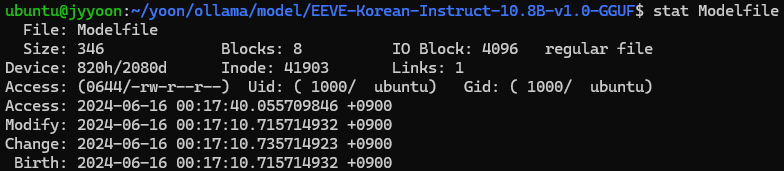
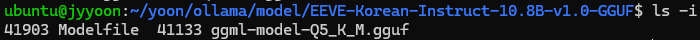

# 6. 파일 시스템

> 파일과 디렉터리(폴더)를 관리하는 커널의 한 부분이며, 한 시스템에서도 여러 파일 시스템을 동시에 사용할 수 있다.

---

## 파일과 디렉터리

### 파일(file)

- 구성요소
  - 이름
  - 실행하기 위한 정보
  - 부가 정보(메타데이터, 속성 - 유형(확장자), 크기, 생성날짜, 생성자, 소유자, 위치 등)
    ```shell
    $ stat {filename}
    ```
    
    

### 블록

- 파일을 접근하여 읽고 쓰는 단위
- HDD의 섹터단위로 접근하지는 않음

### 디렉터리

- 계층적인 트리 구조로 파일을 관리하는 개념
- 구성요소
  - 파일 이름
  - 위치를 유추할 수 있는 정보
- 계층적이기 때문에 경로가 있음
- 대다수의 운영체제는 **디렉터리와 파일을 동일하게 간주함**

## 파일 시스템이 만들어지기까지

### 파티셔닝과 포매팅
- 파티셔닝: 다양한 파일 시스템을 사용하기 위해서 영역을 구획하는 작업
- 파티션: 구획된 영역
- 포매팅(포맷): 해당 파티션에 파일 시스템을 만드는 작업

### 마운트
- 파일 시스템에 접근할 경로 설정
- 예시
  - usb를 PC에 꼽으면 드라이브가 하나 생성되는데, 그 과정이 '마운트'
  - 즉, 그 경로를 통해서 usb에 접근할 수 있음
  - usb 파일시스템이 호스트 PC의 파일시스템에 편입되는 것!

## 파일 시스템 종류와 특성

- 운영체제는 보조기억장치에 접근할 때 `블록 단위`로 접근함
- 연속적으로 할당하면 결국 `외부 단편화`가 발생할 수 밖에 없음
- 따라서 랜덤한 위치에 지정함 -> 랜덤한 위치에 할당하면 따라오는 것은 **정보 테이블!!** 

### FAT(File Allocation Table) 파일 시스템
- FAT를 활용한 파일 시스템
- FAT는 메모리에 캐시되어 있음 (블록주소 및 다음 블록주소가 매핑된 테이블)
- 저용량 저장장치(usb, sd카드 등)에 보통 사용됨
- 보통 16비트, 32비트 주소체계로 주소 지정 가능한 블록 수가 제한되어 있기 때문

### Unix
- 아이노드(i-node)라는 **색인 블록**을 활용한 파일 시스템
- **색인 블록(index block)**
  - 이 파일은 어디에 위치하는지를 모두 담아놓은 블록
  - 즉, 이 색인 블록만 읽으면 해당 파일의 모든 블록 위치와 정보를 담고 있음
- 대용량 파일의 경우 계층적 구조로 큰 파일을 관리하게 됨
  - 한 색인 블록에 모든 블럭의 위치를 다 담지 못하니까!
  - 때문에 오버헤드가 발생할 수 있음
- 파티션 내에 아이노드 영역이 따로 있음

  |예약영역|i-node 영역| 데이터 영역 |
  |---|------|--------|

  
  - 41903이 i-node 번호

> 아이노드가 꽉 차면?
> 
> 데이터 영역에 용량이 남아있더라도 더이상 파일을 생성할 수 없다!
> 즉, 아이노드 영역과 데이터 영역이 조화롭게 사용되며 파일이 할당됨
> ```shell
> # 아이노드 영역 용량 확인
> df -ih
> ```

### NTFS
- 윈도우 운영체제에서 주로 사용됨
- 64비트 주소체계

### APFS
- macOS, iOS 등에서 주로 사용됨
- 64비트 주소체계

### ext4, xfs
- 리눅스에서 주로 사용됨
- 64비트 주소체계

### 저널링 파일 시스템 (journaling file system)
- 파일 시스템에 크래쉬가 발생했을 때 빠르게 복구하기 위한 방법
- 복구를 위해 '로그'를 남기는 작업을 함
  - 작업 순서
    1. 작업 직전 파티션의 로그 영역에 로그를 남김
    2. 로그를 남긴 후 작업을 수행
    3. 작업 수행 후 로그를 삭제