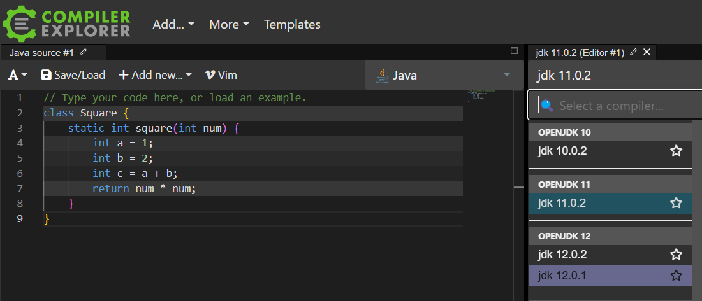
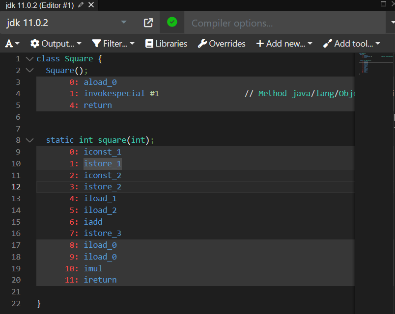
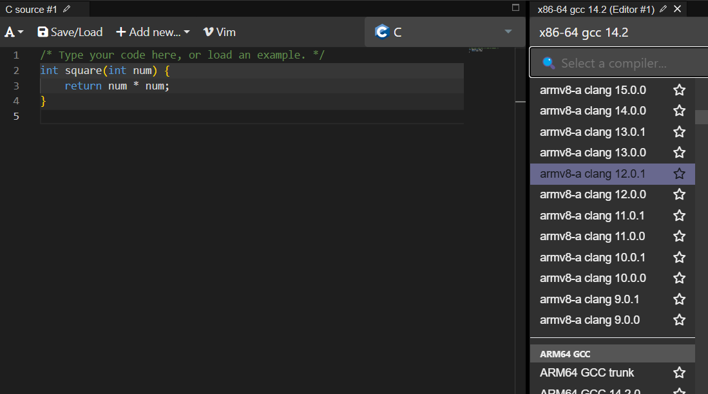
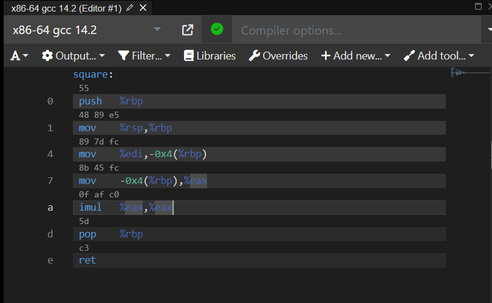

# 2. 명령어

---

컴퓨터는 소스코드(=고급언어)를 곧장 이해할 수 없다. 컴퓨터가 이해할 수 있는 언어는 저급언어 혹은 명령어(=이진수, 바이너리코드)라고 부른다.

때문에 소스코드를 명령어로 바꿔줘야 하는데 이 과정을 `컴파일` 혹은 `인터프리트`라고 한다.
이 과정은 코드를 `검사` 하고 기계어로 `변환` 하는 목적을 갖는다.

### 저급 언어의 두 종류

1. 기계어(machine code)
    - 이진수
    - cpu, 컴파일러에 따라서 다르게 바뀔 수 있다.
2. 어셈블리어(assembly language)
    - 그래도 사람이 이해할 수 있는 형태
    - `연산 | 연산대상` 과 같은 구조로 명령어가 나열되어 있다.

### 컴파일과 인터프리트

- 컴파일은 `컴파일러`라는 프로그램으로 소스코드를 명령어(기계어)로 변경한다. 이후 실행 시점에 실행한다.
- 인터프리트는 실행 시 소스코드 한 줄씩 `인터프리터`라는 프로그램으로 명령어(기계어)로 변경하고 실행한다.
- 즉, 소스코드를 명령어로 변경하여 실행하는 방법은 동일한데, 명령어로 변경하는 `시점`이 다르다.
- 따라서 실행성능은 미리 명령어로 변경해놓는 `컴파일` 방식이 유리하다.
- 이 두 방식은 칼로 자르듯 구분되는 것은 아니며 `Java`와 같이 양쪽 특성을 모두 갖춘 언어도 있다.

> **Java는 왜 양쪽 특성을 모두 갖추었다고 하나?**
> 
> Java는 Java 컴파일러(javac)에 의해 `바이트코드`로 변환이 된다.
> 이 바이트코드는 명령어(기계어)가 아니라 `JVM`이 이해할 수 있는 중간 언어다.
> Java 코드 실행시점에는 `JVM`이 `인터프리터`를 사용하여 바이트코드를 한 줄씩 해석해서 명령어(기계어)로 바꾸어 실행한다.
> 자주 실행되는 코드는 `JIT 컴파일러`를 통해 실시간으로 명령어로 컴파일해서 속도를 높인다. (실행 중 최적화) 
> 인터프리터와 JIT 컴파일러는 `JVM의 실행엔진`에 포함되어 있다.
> 
> [https://godbolt.org/](https://godbolt.org/)에 가면 컴파일하면 어떤 식으로 결과물이 나오는지 볼 수 있다.
> 
> 재미있는건, java 코드를 컴파일하려면 컴파일러를 `JDK` 버전들을 선택하게 되어 있다. 즉, JVM이 이해할 수 있는 바이트코드로 변환된다는 것을 한번 더 알 수 있다.
> - java언어의 컴파일러 선택창
> 
> - 바이트코드 컴파일 결과
> 
> - C언어의 컴파일러 선택창
> 
> - 명령어 컴파일 결과
> 

### 명령어의 구조

- `무엇을 대상`으로 `무엇을 수행`해라

### 대상

- `오퍼랜드` = `피연산자` = `데이터`
- 오퍼랜드에는 대상 데이터가 직접 명시되기도 하고, 대상의 위치(=레지스터 이름, 메모리 주소)가 명시되기도 함

> **왜 데이터를 직접 명시하지 않을까?**
> 
> 오퍼랜드에는 길이가 한정되어있기 때문에 대상 데이터의 크기가 크면 다 명시할 수 없기 때문이다.
> 따라서 오퍼랜드에 주소를 지정하는 여러가지 방법들이 있다.
> 
> 그 전에 개념 2가지를 먼저 알아보자.
> 
> `유효주소` - 연산 대상이 되는 데이터가 저장된 위치
> `주소지정` - 유효 주소를 찾는 방법
> 
> **주소지정의 종류**
> 
> 1. `즉시 주소 지정` - 데이터 직접 명시
> 2. `직접 주소 지정` - 메모리 주소 명시, 메모리에 1번 접근
> 3. `간접 주소 지정` - 유효 주소 명시, 메모리에 2번 접근(1번째에 진짜 주소 알아내서 2번째에 데이터 접근)
> > **왜 메모에 유효 주소를 명시하여 2번 접근하게 만들까?**
> > 
> > 배열 인덱싱(시작위치 및 범위 활용), 함수 포인터(함수는 한번만 할당), 동적 데이터나 자료구조(자료구조 내에서 참조하는 값이 달라지는 경우) 등의 처리를 통해 유연성 및 재사용성을 높일 수 있기 때문에 사용한다.
> > 
> 4. `레지스터 주소 지정` - 데이터가 들어있는 레지스터 명시
> 5. `레지스터 간접 주소 지정` - 메모리 주소가 들어있는 레지스터 명시, 메모리에 1번 접근하면서 간접 주소 지정의 장점을 취함.

### 수행  

- 대상을 어떻게 다룰 것인지
- `데이터 전송`, `산술/논리연산`, `제어 흐름 변경`, `입출력 제어` 등

