# 4. CPU

---

## CPU의 핵심 구성요소

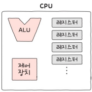

- ALU (산술논리연산장치): 연산을 수행하는 회로 장치
- 제어장치: 명령어를 해석하고 제어신호를 내보내는 장치
- 레지스터들: 명령어 처리 전후로 값을 임시저장하는 장치 (일반적으로 여러개)

위 세 가지 핵심요소가 CPU를 이루며, CPU의 발전에 따라 이 묶음이 이제는 `코어`라고 명명하게 되며 CPU 안에 `n개의 코어` 즉, `멀티코어 CPU`가 대중화 됐다.

## ALU

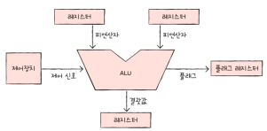

- 입력: 레지스터를 통해 피연산자와 제어장치를 통해 제어신호가 들어오면
- 연산: ALU가 연산을 진행하고 
- 출력: 레지스터와 플래그 레지스터(overflow, 음수 등)에 결과값을 저장한다.

### 플래그 레지스터

연산 결과에 대한 부가 정보를 담는 레지스터.  
부호, 제로, 캐리, 오버플로우, 인터럽트, 슈퍼바이저 등의 정보를 담는 플래그들이 있다.

### 제어장치

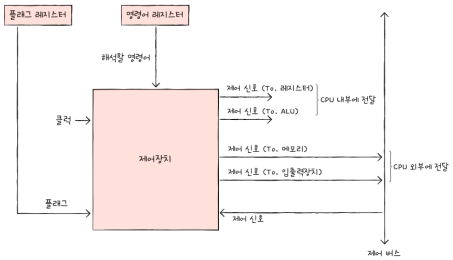

- 해석할 명령어와 부가정보를 받아서 `클럭신호`에 맞춰 제어신호를 내보내고 명령어를 해석하는 장치
- CPU 내부에 전달하는 신호는 레지스터나 ALU로 직접 향한다.
- CPU 외부에 전달하는 신호는 메모리나 입출력장치 등으로 제어 버스(시스템 버스 중 하나)를 통해 주고 받는다.

> **클럭?**
> 
> 부품을 일사분란하게 움직일 수 있게 하는 시간 단위.  
> 부품들의 박자라고 생각하면 된다. 클럭신호는 기본 주기가 있으나, 상황에 따라서 변할 수 있다.

### 레지스터

- CPU 연산 전후로 값을 임시 저장하는 작은 저장장치
- 필요에 따라 크기, 종류가 다양하다.

1. 프로그램 카운터 - 메모리에서 다음으로 가져올 명령어 주소를 저장하고 있다.
2. 명령어 레지스터 - 해석할 명령어(주소)
3. 메모리 주소 레지스터 - 메모리 주소 (읽어들일 주소 값) <-- 시스템버스의 '주소버스'로 전달된다.
4. 메모리 버퍼 레지스터 - 메모리와 주고받을 명령어와 데이터 <-- 시스템버스의 '데이터버스'로 전달된다.
5. 플래그 레지스터 - 연산 결과에 대한 부가정보를 저장
6. 범용 레지스터
7. 스택 포인터 - 스택 주소 꼭대기를 가리키는 레지스터
8. 베이스 레지스터 - 변위 주소 지정 방식에 사용되는 '떨어진 거리'를 가리키는 레지스터

> **메모리 내의 스택**
>
> 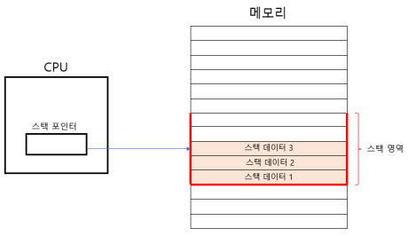
> 메모리 내에는 스택 영역이 따로 있다.

> **주소 지정 방식**
> 
> 연산할 코드(=피연산자, 오퍼랜드)에 `특정 값`을 더하여 유효주소를 알아낸다.
> 
> - 특정 값이 `프로그램 카운터`라면 `상대 주소 지정방식`
> - 특정 값이 `베이스 레지스터`라면 `베이스 레지스터 주소 지정방식`

## 인터럽트

CPU는 기본적으로 `인출` -> (`간접` -> ) `실행` 세 가지 사이클로 명령어를 처리할 수 있다.

*간접 사이클은 인출한 명령어가 참조할 주소값인 경우 한번 더 메모리에 접근하는 경우이다*

이런 흐름을 방해하는 신호를 `인터럽트`라고 한다.  
인터럽트는 `Exception`이나 `Fault(Page Fault, Segmentation Fault)`와 같은 `동기 인터럽트`와
주로 입출력장치에 의해서 발생하는 `비동기 인터럽트`로 구분할 수 있다.

그 중 비동기 인터럽트에 대해 알아본다.

### 비동기 인터럽트

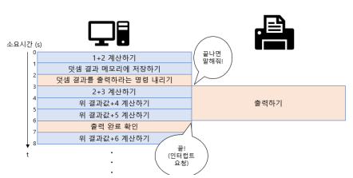

웹 개발에서 콜백 같은 느낌이다.

1. CPU는 한 단위의 연산을 처리한 후 인터럽트 온 것이 있는지 확인한다.
2. 인터럽트가 온 것이 있으면 `인터럽트 플래그` 를 통해 내가 지금 인터럽트 처리가 가능한지 확인한다.
3. 가능하면 지금까지 작업을 메모리 스택영역에 백업한다.
4. *인터럽트 벡터*를 참고하여 *인터럽트 서비스 루틴*을 실행한다.
5. 인터럽트 작업 처리 후 백업한 작업을 복구하여 실행을 이어간다.

> **인터럽트 서비스 루틴?**
> 
> 인터럽트 종류별 실행할 내용이다. (ex, 사용자 입력 인터럽트가 발생하면 어떻게 처리해라)
> 
> **인터럽트 백터?**
> 
> 인터럽트 종류별 서비스 루틴의 위치(주소)

## 인터럽트를 포함한 CPU의 실행 사이클

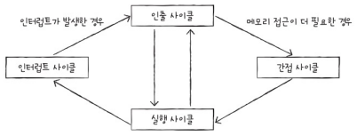

## 멀티 프로세스와 멀티 스레드

|관점|최상위 단위|실행 단위| 설명         |
|---|------|-----|------------|
|하드웨어|프로세서 (Processor)|	코어 (Core) / 하드웨어 스레드|	물리적 장치와 그 안의 처리 능력을 뜻함.|
|소프트웨어|	프로세스 (Process)|	소프트웨어 스레드|	프로그램 실행과 그 안의 논리적 작업 단위를 뜻함.|

개발자는 **소프트웨어 관점에서의 프로세스와 스레드에 대해서 관여**하게 되며, **하드웨어** 관점에서의 코어 및 하드웨어 스레드는 **운영체제가 알아서 스케줄링하여 실제 작업을 진행**하게 된다.

즉, 소프트웨어 입장에서는 내 프로그램이 하드웨어의 '코어'에 의해 동작하는지, 코어가 가진 '스레드'중 하나로 동작하는지는 관심사가 아니다.
그리고 이 내용들은 모두 `성능을 높이기 위한 목적`을 갖는다는 것이다.

## 명령어 파이프라이닝

하드웨어적으로는 클럭을 높이거나, 멀티 코어, 멀티 스레딩 기법등을 사용하여 성능을 높일 수 있다.
소프트웨어적으로는 명령어 처리방식인 `명령어 파이프라이닝`을 잘 설계하여 성능을 높일 수 있다.

- 주요 아이디어: 하나의 명령어가 처리되는 과정(인출-해석-실행-저장)을 비슷한 시간 간격으로 나누어 처리하자.
=> CPU 구성요소가 겹치지 않게. 즉, 모든 구성요소를 놀리지 않고 다 쓰게 하여 효율을 높이는 방법

### **파이프라이닝 X**
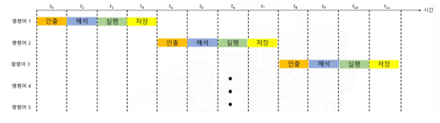
- 명령어 처리과정을 쪼개지 않고 처리하여 다른 CPU 구성요소들이 놀게된다.
### **파이프라이닝 O**
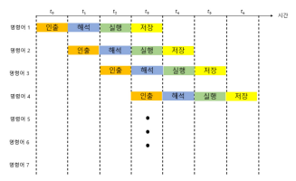
- 각 과정마다 필요한 CPU 구성요소가 다르기 때문에 한 사이클(클럭)에 모든 CPU 구성요소를 최대한 활용한다.
- 위험도 존재한다.
  1. 데이터 위험:
     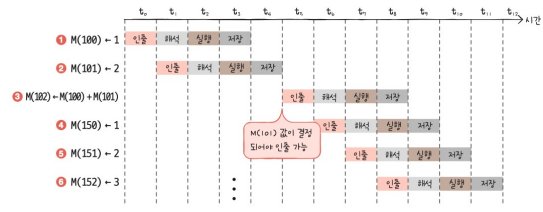
     - 데이터가 명령어 전반에 의존적일 때는 겹쳐서 실행하기 어려울 수 있음
     - 이는 `비순차적 명령어 처리`(ex, 의존성이 있는 경우 앞의 연산이 다 처리될 때 까지 기다리지 않고 의존성 없는 다른 명령어를 먼저 처리)하는 식으로 성능 개선
  2. 제어 위험
      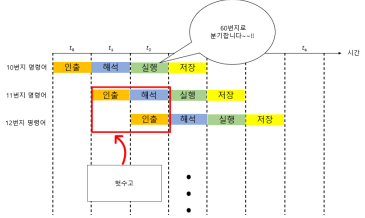
     - 다음 주소지의 명령어를 실행하기 위해 명령어를 인출하고 해석중이었는데, 앞 명령어가 다른 위치로 이동하는 경우
  3. 구조적 위험
      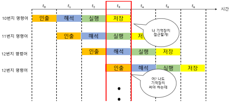
     - 서로 같은 자원을 사용하려고 할 때

> **CISC와 RISC**
>
> CISC는 보통 Intel x86 CPU 아키텍처로 `복잡하고 다양한 (그래서 긴) 명령어`를 사용 -> 파이프라이닝에 `불리`.
>
> RISC는 ARM CPU 계열 아키텍처로 `간단하고 단순한 (그래서 짧은) 명령어`를 사용 -> 파이프라이닝에 `유리`.
>
> > *CISC는 하나의 명령어로 더 많은 일을 처리할 수 있어 코드 크기가 작을 수 있었기 때문에, 메모리와 하드웨어 스펙이 부족했던 옛날에는 유리했다.*