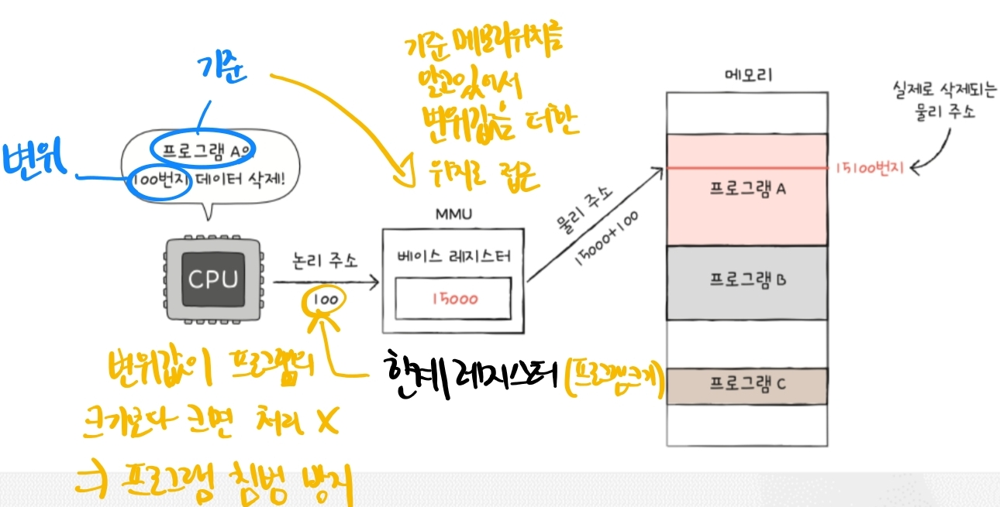
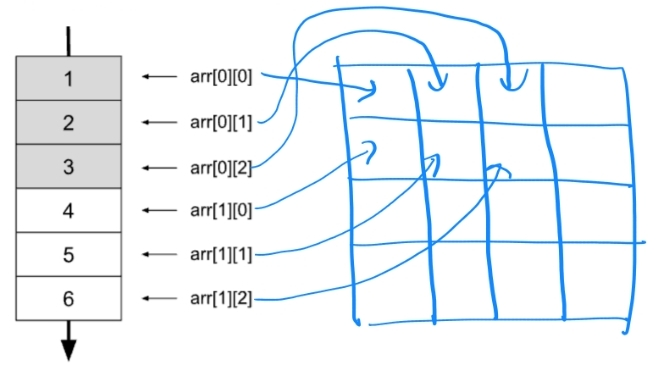

# 5. 메인 메모리와 캐시 메모리

---

## RAM과 ROM

- RAM 
  - Random Access Memory 
  - 어느 메모리 위치에도 동일한 시간에 접근할 수 있는 기억장치
  - 휘발성
- ROM
  - Read Only Memory
  - 제조 과정에서 저장할 내용을 미리 기록하는 기억장치
  - 냉장고, 전자레인지, 게임기와 같은 가전제품에 많이 사용됨
  - 현제는 `플래시 메모리`의 형태로 보조기억장치(USB, SD카드, SSD 등)로 가장 흔하게 접할 수 있음

=> 흔히 `메모리`라는 용어는 `RAM`을 지칭하는 경우가 많다.

## 엔디안

메모리에서 데이터를 저장하고 읽는 방식, 즉 `바이트 순서`를 나타내는 개념이다.

### 빅 엔디안

데이터의 "큰 쪽" 바이트가 낮은 메모리 주소에 저장됨. 즉, `0x1234`를 저장한다면 메모리에 `12 34` 순서로 저장된다는 뜻이다.
쓰고 읽는 순서가 일상적인 순서와 동일하기 때문에 디버깅에 용이하다. `네트워크의 TCP/IP`가 빅 엔디안을 표준으로 사용한다.

### 리틀 엔디안

반대로 데이터의 "작은 쪽" 바이트가 낮은 메모리 주소에 저장되는 형태다. 
작은 쪽부터 올라가다보니 수치 계산(ex, 자리 올림 등)이 편리하여 요즘 많이 사용한다.

> 엔디안을 배워야 하는 이유?
> 
> 서로 다른 시스템 간에 데이터를 전송할 때는 엔디안을 고려해야 데이터가 꼬이지 않는다!!

## 논리 주소와 물리 주소

### 물리 주소

실제 메모리의 하드웨어 상의 고유 주소

### 논리 주소

CPU와 실행중인 프로그램이 사용하는 주소로, 프로그램마다 0번지부터 시작한다.

=> 그렇다면, 누가 논리 주소를 물리 주소로 변환시켜 주는 것일까?

### MMU(Memory Management Unit)

- 논리 주소와 물리 주소간의 변환을 담당하는 장치



- 베이스 레지스터를 통해 프로그램의 시작지점의 주소를 확인한다.
- CPU가 전달해주는 논리주소(변위값)을 더해서 물리 주소를 찾는다.
- 한계 레지스터의 크기를 넘는 논리주소 요청이 오면 처리를 하지 않아 프로그램 침범을 방지한다.

## 메인 메모리와 캐시 메모리

연산은 CPU가 담당을 하는데, CPU와 멀어질수록 `속도 감소`, `비용 감소`의 특징이 있다.
비용 이슈로 인해 레지스터를 무작정 키울 수 없다. 따라서 CPU에서 사용할 법한 정보를 미리 가져와 저장하는 `캐싱`의 역할이 중요해졌다.

### 참조 지역성의 원리

데이터는 `시간`과 `공간` 적으로 가까운 곳에 다시 접근하려는 성향이 있다.

> **CPU의 캐싱을 코드에 반영할 수 있나?**
> 
> `참조 지역성의 원리`를 활용하여 캐시 친화적 코드를 작성할 수 있다.
> 
> 예를 들어, 2차원 배열을 순회할 때는 `열`로 순회하는 것보다 `행`으로 순회하는 것이 유리하다.
> 
>
> ```java
> public class Main {
>   public static void main(String[] args) {
>     int[][] matrix = new int[10000][10000];
> 
>     // 캐시 친화적
>     long startTime = System.currentTimeMillis();
>     for (int i = 0; i < 10000; i++) {
>       for (int j = 0; j < 10000; j++) {
>         matrix[i][j] = 1;
>       }
>     }
>     long endTime = System.currentTimeMillis();
>     System.out.println("캐시 친화적 코드: 걸린 시간 - " + (endTime - startTime));
> 
>     // 캐시 비친화적
>     startTime = System.currentTimeMillis();
>     for (int i = 0; i < 10000; i++) {
>       for (int j = 0; j < 10000; j++) {
>         matrix[j][i] = 1;
>       }
>     }
>     endTime = System.currentTimeMillis();
>     System.out.println("캐시 비친화적 코드: 걸린 시간 - " + (endTime - startTime));
>   }
> }
> ```
> 
> ```
> 캐시 친화적 코드: 걸린 시간 - 36
> 캐시 비친화적 코드: 걸린 시간 - 396
> ```