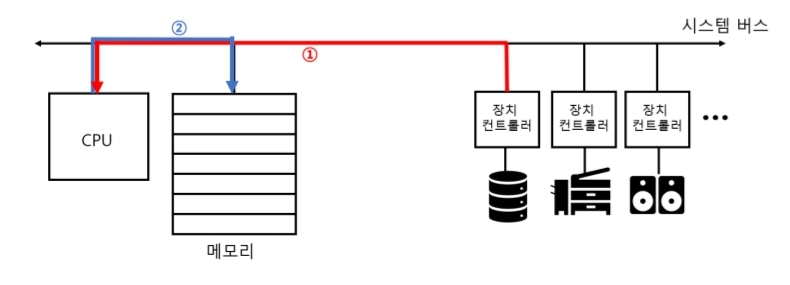
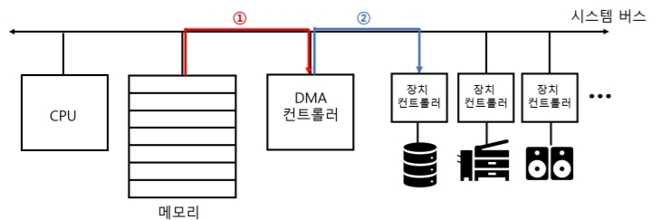
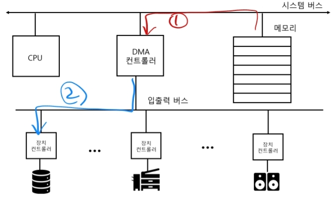

# 6. 보조기억장치와 입출력장치

---

## 보조기억장치

- 하드 디스크, USB 메모리, SD 카드, SSD 등
- 큰 용량의 정보를 안정적으로 보관하는 것이 핵심!

### RAID

- 데이터의 안정성, 높은 성능을 위해 여러 보조기억장치를 하나처럼 사용하게 해주는 기술
- 구성에 따라 RAID 0, RAID 1, RAID 2, RAID 3, RAID 4, RAID 5, RAID 6, RAID 10, RAID 50... 등 다양하다

- RAID 0
  - 단순히 나누어 분산 저장
  - 모든 공간을 사용할 수 있어 성능은 개선되지만, 데이터가 1개뿐이기 때문에 신뢰성은 낮음

    => 신뢰성을 높일 수 없을까?

- RAID 1
  - 복사본을 만들어 저장
  - 저장 공간 1/2, 신뢰성 증가 (한 저장공간이 망가져도 다른 쪽 사용이 가능)
  
    => 저장공간 효율을 높일 수 없을까?

- RAID 4
  - 오류 검출용 디스크를 하나 두어 패리티 비트를 저장
    - 모든 합을 홀수, 짝수 중 하나로 맞춘다는 규칙을 정하여 RAID 구성 하드 중 임의의 하나가 망가져도 유추하여 복구 가능
    - 패리티 디스크가 병목지점이 생김
  
    => 성능을 높일 수 없을까?

- RAID 5
  - 패리티 비트를 모든 디스크에 나누어 저장

- RAID 6
  - 패리티 비트를 2개를 두어 신뢰성을 높임
  - RAID 5 보다 디스크 공간 및 쓰기 성능 감소

- nested RAID (ex, RAID 10, RAID 50 등)
  - 여러 RAID 구성 방식을 합쳐 레이어로 구성한 방식
  - ex) RAID 10 => RAID 1 + RAID 0

## 입출력 장치

- 마우스, 키보드, 모니터, 프린터 등...
- 사실 보조기억장치는 입출력 장치의 처리방식과 크게 다르지 않다.

### 입출력 장치의 특징

- 종류가 매우 다양하다.
- 매우 느려서 CPU와 함께 일하기 어렵다.

### 장치 컨트롤러

- CPU와 입출력장치간의 통신을 중계하는 역할을 한다.
- 즉, `입출력이란 CPU가 장치 컨트롤러를 사용하는 것`이라고 생각하면 된다.

### 입출력 방법

1. 프로그램 입출력: 입출력 명령어를 수행하는 방법
2. 인터럽트 기반 입출력: 인터럽트를 사용하여 수행하는 방법
3. DMA 기반 입출력: 직접 메모리에 접근하여 정보를 주고받는 방법

### DMA 를 사용하는 입출력 방법

- DMA가 없다면?

  
  - CPU가 모든 입출력을 컨트롤 해야함.
  - 그림처럼 `1. 입력받은 내용을 가져`와서 `2. 메모리에 저장해라`
  - 반대 출력상황도 비슷한 상황이 될 것
    
  > 나 비싼 CPU인데, 시간 아깝게 이런거 시킬거야?

- DMA(직접 메모리 접근) 장치 사용하면?

  
  - CPU는 메모리에 저장만 하면 `DMA 컨트롤러`가 직접 메모리에 있는 데이터를 가져다가 출력할 수 있음
  
  > 좋긴 한데, 공유자원인 `시스템 버스`를 사용하는 사이클(클럭)을 도둑맞아서 CPU가 작업을 원할하게 하지 못하는 상황은 비슷하잖아?

- DMA + 입출력 버스

  
  - 장치 컨트롤러들은 `입출력 버스`를 사용하면 `시스템 버스` 사용 사이클을 줄일 수 있음!

