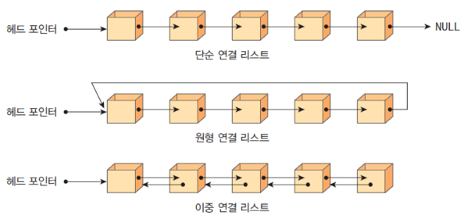
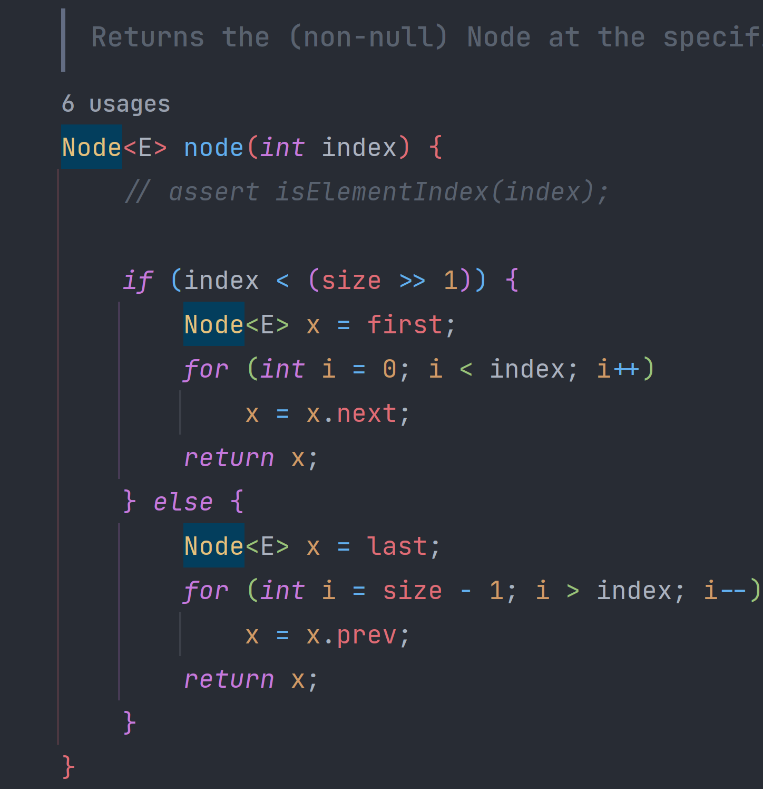

# 연결 리스트 (Linked List)

---

# 1. 이론 학습

- 데이터를 링크로 연결해서 관리하는 자료구조
- 자료의 순서는 정해져 있지만, 배열처럼 메모리상 연속성이 보장되지는 않음

## 기본 구조

- 노드: 데이터 저장 단위. 값(데이터)과 포인터(연결정보)로 구성됨



## 장점

- 공간 미리 할당 필요없음
- 데이터 추가/삭제가 용이

## 단점

- 연결 구조를 위한 데이터 공간 필요
- 연결정보를 찾는 시간(메모리 접근 시간)이 필요

---

# 2. 구현 실습

## 구현된 MyLinkedList

[MyLinkedList.java](MyLinkedList.java)

---

# 3. 구현하면서 느낀 점

### Iterator 구현

자주 사용하게 되는 Iterator도 함께 구현해보았다.

리스트 구현체는 `public class MyLinkedList<T> implements Iterable<T> {}` 와 같이 구현해야하며
```java
public interface Iterable<T> {
  
    // 구현이 필요한 메서드
    Iterator<T> iterator();
    
    default void forEach(Consumer<? super T> action) {
        Objects.requireNonNull(action);
        for (T t : this) {
            action.accept(t);
        }
    }
    
    default Spliterator<T> spliterator() {
        return Spliterators.spliteratorUnknownSize(iterator(), 0);
    }
}
```
리턴해야할 `Iterator<T>`는 내부 클래스에서 상속하는 구현체를 `private class MyIterator implements Iterator<T> {}` 처럼 한번 더 구현해야 한다.

```java
@Override
public Iterator<T> iterator() {
  return new MyIterator();
}

// 필요한 메서드만 구현함
private class MyIterator implements Iterator<T> {
  private MyNode<T> current = head; // 처음엔 head부터 시작

  @Override
  public boolean hasNext() {
    return current != null; // 다음 노드가 있으면 true
  }

  @Override
  public T next() {
    if (!hasNext()) {
      throw new java.util.NoSuchElementException("No more elements");
    }
    T data = current.getData(); // 현재 데이터 반환
    current = current.getNext(); // 다음 노드로 이동
    return data;
  }
}
```

### 리스트 순회 시 성능에 대한 이슈

```java
[인덱스 기반 순회]
for (int i = 0; i < list.size(); i++) {
    int data = list.get(i);
    System.out.println(data);
}

[for-each 순회]
for (int data : list) {
    System.out.println(data);      
}
```

(부끄럽지만) 위 두 순회에 대해서 성능적으로 크게 생각해본 적이 없었다.
그러나, 구현을 하면서 알게 되었다.

먼저, 인덱스 기반 순회 작업 시 접근하게 되는 코드에 동작출력문을 넣어보자.
```java
public MyNode<T> getNode(int index) {
  try {
    MyNode<T> current = this.head;
    for (int i = 0; i < index; i++) {
      System.out.println("--> 다음 노드!"); <-- 이부분
      current = current.getNext();
    }
    return current;
  } catch (NullPointerException e) {
    throw new MyLinkedListIndexOutOfBoundsException();
  }
}
```

실행할 코드는 아래와 같다
```java
public class Example {
  public static void main(String[] args) {
    MyLinkedList<Integer> list = new MyLinkedList<>();
    list.add(1);
    list.add(2);
    list.add(3);
    list.add(4);
    list.add(5);

    System.out.println("===인덱스 기반 순회===");
    for (int i = 0; i < list.size(); i++) {
      System.out.println(list.get(i));
    }
    System.out.println();

    System.out.println("===iterator 순회===");
    for (Integer integer : list) {
      System.out.println(integer);
    }
    System.out.println();
  }
}
```

그럼 아래와 같이 출력된다.
```text
===인덱스 기반 순회===
1
--> 다음 노드!
2
--> 다음 노드!
--> 다음 노드!
3
--> 다음 노드!
--> 다음 노드!
--> 다음 노드!
4
--> 다음 노드!
--> 다음 노드!
--> 다음 노드!
--> 다음 노드!
5

===iterator 순회===
1
2
3
4
5
```

특징을 아래 표처럼 정리할 수 있겠다.

| **특징**| **인덱스 기반 순회 (`for i`)** | **`for-each` 순회 (`for :`)** |
|----------------------|---------------------------------------------------------------------------------------------|-----------------------------------------------------------------------------------------------|
| **접근 방식** | 인덱스를 사용해 `get(i)`로 요소를 직접 가져옴.| `Iterator`를 통해 리스트를 순차적으로 탐색.|
| **내부 동작**| `get(i)`가 호출될 때마다 `head`에서부터 인덱스까지 노드를 순회| `Iterator`의 `next()`가 호출되며, 현재 노드에서 다음 노드로 이동하며 데이터 반환.|
| **시간 복잡도**| - 한 번의 `get(i)`: O(n) (인덱스까지 순회).<br>- 전체 순회: O(n²) (n번의 O(n) 호출).<br>- 배열 기반 자료구조라면 O(n). | - 한 번의 `next()`: O(1) (다음 노드로 이동).<br>- 전체 순회: O(n) (리스트 전체를 한 번만 탐색). |
| **장점**| - 인덱스를 제어 가능 (특정 위치 접근, 중간 멈춤 가능).<br>- 구현이 간단 (별도 인터페이스 필요 없음). | - 코드가 간결하고 가독성 좋음.<br>- 연결 리스트처럼 순차 접근에 최적화됨 (O(n)).|
| **단점**| - 연결 리스트에서 비효율적 (O(n²)).<br>- 반복마다 인덱스 계산 필요.| - `Iterable`과 `Iterator` 구현 필요.<br>- 인덱스 직접 제어 불가.|
| **적합한 자료구조**| 배열(`ArrayList`)처럼 랜덤 액세스가 빠른 경우 (O(n)으로 개선됨).| 연결 리스트(`LinkedList`)처럼 순차 접근이 효율적인 경우.|

물론 실제 `java.util.LinkedList`는 이중 연결 리스트라 `get(i)`를 할 때 가운데를 기준으로 순방향 / 역방향 접근을 선택해 조금 더 효율적이긴 하다.



> 배열을 제외한 `List` 자료구조에서는 `Iterator`를 활용한 순회를 좀 더 적극적으로 사용해야 겠으며, <br>
> 인덱스 관리가 필요하면 `for :` 순회 밖에서 index를 생성해 넣어주는 식으로 컨트롤 하면 되겠다. 

---

# 4. 추가적인 도전과제

### 마지막 노드 캐싱 (2025-03-13 완료)

가장 흔하게 호출되는 메서드는 `add(T data)` 메서드일 것이다. 해당 메서드는 index가 없기 때문에 가장 마지막에 데이터를 추가한다.
따라서 가장 마지막 노드에 접근하는 속도를 빠르게 하면 성능 상 이점이 있을 것이다.

[BigOTest 코드 참고](BigOTest.java)

### 리스트 추가

`addAll(MyLinkedList<T> list)` 메서드로 리스트를 바로 합칠 수 있도록 구현해보자.

### 요소 삭제

- `delete(int index)`
- `delete(T data)`