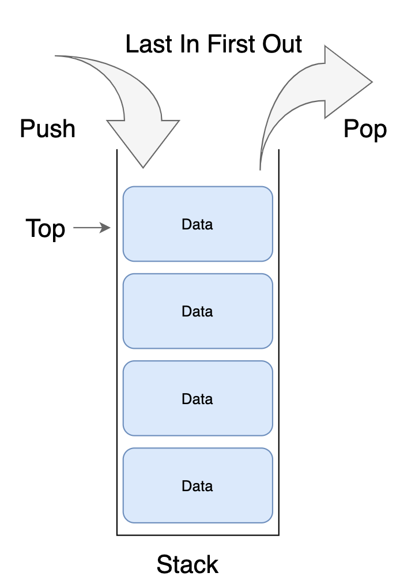

# 스택 (Stack)

---

# 1. 이론 학습

- 후입선출(LIFO: Last In First Out) 자료구조
- 데이터가 입력된 역순으로 처리되어야 할 때 사용

## 기본 구조

- 두 가지 형태가 있을 수 있음
  - 배열기반
  - 노드기반
- 데이터를 넣는 `push`와 꺼내는 `pop` 연산을 기본 제공

## 장점

- 구조가 단순하여 구현 및 관리가 쉬움

## 단점

- 중간 데이터 접근이 어려움

---

# 2. 구현 실습

## 구현된 코드

[MyStack.java](MyStack.java)

---

# 3. 구현하면서 느낀 점

### Vector 클래스 상속과 애매한 포지션

java에서 실제로 구현한 `java.util.Stack` 클래스를 찾아보니 아래와 같았다.  
`public class Stack<E> extends Vector<E> {}`  
`public class Vector<E> extends AbstractList<E> implements List<E>, RandomAccess, Cloneable, java.io.Serializable {}` 
`java.util.Vector` 클래스를 보니 `Object[]` 및 구성요소와 메서드들이 보였다. 왜 Stack에서 직접 구현하지 않고 Vector를 확장했을까? Vector가 뭔데?

살펴보니 공유자원에 접근하는 메서드에 `synchronized` 키워드들이 붙어있었다. 즉, 멀티스레드 환경을 염두한 배열기반 클래스였고, 배열을 초기화하고 CRUD하는 메서드들이 기본적으로 구성되어 있었다.

포지션이 애매해보였다. 우리가 많이 사용하는 컬랙션 클래스들(e.g. `ArrayList`, `LinkedList`, `HashMap`...)은 멀티스레드 환경을 기본적으로 배제한다. 필요시 `java.util.concurrent` 패키지를 사용하여 동시성을 보장하도록 하여 사용한다.
그러나 Stack은 기본클래스(?)에서 이미 멀티스레드를 염두해두었다니... 뭔가 통일성이 좀 떨어지는 나만의 느낌을 받았다.

Stack 클래스의 주석을 다시 살펴보았다.

> The Stack class represents a last-in-first-out (LIFO) stack of objects. It extends class Vector with five operations that allow a vector to be treated as a stack. The usual push and pop operations are provided, as well as a method to peek at the top item on the stack, a method to test for whether the stack is empty, and a method to search the stack for an item and discover how far it is from the top.
> When a stack is first created, it contains no items.
> A more complete and consistent set of LIFO stack operations is provided by the Deque interface and its implementations, which should be used in preference to this class. For example:
> `Deque<Integer> stack = new ArrayDeque<Integer>();`

주석에서도 이 클래스보다 완전하고 일관된 LIFO 스택 연산을 제공하는 `Deque` 인터페이스를 사용하라고 한다.

(그러고 보니, 맨 처음 프로그래밍 학습할 때 강사님께서도 `Stack`은 쓰지 않는걸 추천했던 기억이 어렴풋하게 떠오른다..)

---

# 4. 추가적인 도전과제

- Queue, Deque 구현을 통해 현재 java 클래스에서의 Stack의 아쉬움을 더 확인해보자.