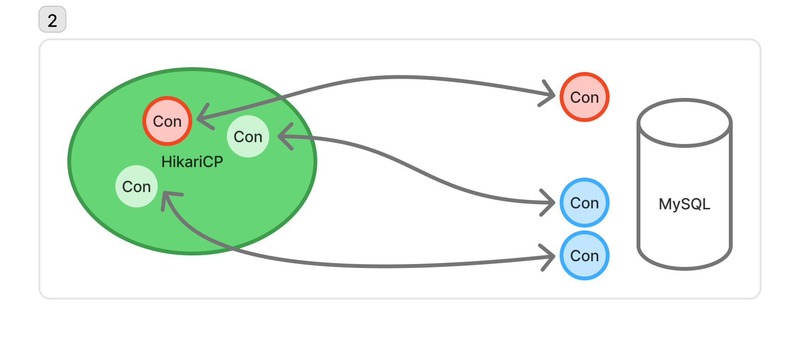

# DBCP (Database Connection Pool)

---

## 1. 개요

DBMS는 클라이언트로부터 요청을 받아 데이터를 전달한다. 이 때, 네트워크를 통해 요청이 들어오게 되는데 TCP 기반으로 동작하게 된다.
이는 송수신 신뢰성을 보장하는 연결 지향적이기 때문에 요청 전(3-way handshake), 후(4-way handshake)에 연결에 대해 관리를 한다.

문제는 이 **연결 과정이 생각보다 자원(컴퓨팅 자원 및 시간)이 많이 소모**된다는 점이다.

때문에 클라이언트는 최초 서버가 기동할 때 커넥션을 미리 연결해두고, 클라이언트가 이를 재활용하는 식으로 비효율을 줄인다.
이를 **_DBCP(Database Connection Pool)_** 이라고 한다.

### 정의

> 연결 풀[1] 또는 커넥션 풀(connection pool)은 소프트웨어 공학에서 데이터베이스로의 추가 요청이 필요할 때 연결을 재사용할 수 있도록 관리되는 데이터베이스 연결의 캐시이다. 
> 연결 풀을 사용하면 데이터베이스의 명령 실행의 성능을 강화할 수 있다. 
> 각 사용자마다 데이터베이스 연결을 열고 유지보수하는 것은 비용이 많이 들고 자원을 낭비한다. 
> 연결 풀의 경우 연결이 수립된 이후에 풀에 위치해 있으므로 다시 사용하면 새로운 연결을 수립할 필요가 없어진다. 
> 모든 연결이 사용 중이면 새로운 연결을 만들고 풀에 추가된다. 
> 연결 풀은 사용자가 데이터베이스에 연결을 수립하는데까지 대기해야하는 시간을 줄이기도 한다. - [위키피디아 정의](https://ko.wikipedia.org/wiki/%EC%97%B0%EA%B2%B0_%ED%92%80)

## 2. DBCP와 DBMS 설정

클라이언트에서 DBCP를 사용하려면 데이터베이스가 연결 풀을 지원해야 한다. 때문에 두 서버 사이의 설정이 조화로워야 문제없이 동작하고 성능의 이점을 얻을 수 있다.

여기서는 나에게도 가장 익숙한 DBCP인 `HikariCP`와 DBMS인 `MySQL`을 예로 들어 학습한다. (HikariCP는 springboot에서도 기본으로 사용하고 있는 DBCP 라이브러리이다)
이 외에도 여러 설정들이 있지만, 가장 중요한 설정값을 살펴본다.

### 1) MySQL 설정 (8.4 ver 기준)
[MySQL 공식 매뉴얼](https://dev.mysql.com/doc/refman/8.4/en/server-system-variables.html)

1. max_connections
   - 클라이언트와 맺을 수 있는 최대 connection 수
   - 기본값: 151개
2. wait_timeout
   - connection이 idle 상태일 때 얼마나 대기하다가 종료할 것인지 결정
   - 비대화형 클라이언트(ex, 애플리케이션)
   - 기본값: 28,800초 (= 8시간)
   - 클라이언트의 비정상적인 connection 연결 종료로 인해 발생할 수 있는 자원 낭비를 방지
3. interactive_timeout
   - connection이 idle 상태일 때 얼마나 대기하다가 종료할 것인지 결정
   - 대화형 클라이언트(ex, MySQL CLI)
   - 기본값: 28,800초 (= 8시간)

### 2) HikariCP 설정 (6.3 ver 기준)
[HikariCP 깃헙](https://github.com/brettwooldridge/HikariCP?tab=readme-ov-file#frequently-used)

1. minimunIdle
   - pool에서 유지하는 최소한의 유휴 커넥션 수
   - 기본값: maximumPoolSize와 동일
2. maximumPoolSize
   - pool이 가질 수 있는 최대 커넥션 수
   - inactive(idle)와 active(in-use) 커넥션의 합의 최대 수
   - 기본값: 10개
3. maxLifetime
   - pool에서 커넥션의 최대 수명
   - inactive인 경우 즉시 제거, in-use인 경우 pool로 반환된 후 제거
   - 이 시간이 지나도 pool에 반환이 안되면 소멸이 안되기 때문에 커넥션 누수가 일어날 수 있음
   - **DB의 wait_timeout보다 몇 초 짧게 설정해야 함!**
     - DBCP에서 해당 시간이 지나기 전이면 커넥션을 가져갈텐데, 그 때 DB 서버에서는 wait_timeout을 지나서 커넥션을 닫으면 에러가 나기 때문
   - 기본값: 1,800,000ms (= 30분)
4. idleTimeout
   - pool에서 유휴커넥션으로 있을 수 있는 시간
   - minimumIdle < maximumPoolSize일 때 적용됨
   - 기본값: 600,000ms (= 10분)
5. keepaliveTime
   - 주기적으로 연결을 테스트하는 간격
   - MySQL의 wait_timeout보다 짧게 설정하는 것이 권장됨
   - 기본값: 120,000ms (= 2분)
6. connectionTimeout
   - pool에서 커넥션을 받기 위해 대기하는 시간
   - 기본값: 30,000 (= 30초) -> 실제 고객의 요청을 대기하기에는 매우 길기 때문에 적절한 설정이 필요함

### 3) 예시

**만약 minimumIdle이 2, maximumPoolSize가 4라면?**

1. 최초 HikariCP는 2개의 커넥션을 생성한다.

2. 요청 처리 시 2개 중 1개의 커넥션을 사용한다면, `minimumIdle` 개수인 2개를 맞추지 못하니 1개를 더 생성하여 2개를 유지한다.

3. 이 과정이 `maximumPoolSize`인 4개까지 진행된다. 즉, 2개의 in-use, 2개의 inactive 커넥션까지 생성된다.

4. 여기서 커넥션이 하나 더 사용되어 in-use 커넥션이 3개가 되어도, `maximumPoolSize`인 4개가 되었기 때문에 더 이상 커넥션을 만들지 않는다.

5. in-use 커넥션이 4개가 되면 5번째 요청에서는 `connectionTimeout`만큼 대기를 하게 된다. (그 안에 못받으면 Exception)

6. 부하가 종료되고 in-use 커넥션이 2 이하로 사용되어도 `idleTimeout`만큼 inactive 커넥션은 유지된다.

7. `idleTimeout`설정 시간이 지난 커넥션은 종료하고 `minimumIdle` 개수만 유지한다.

> `minimumIdle`과 `maximumPoolSize`를 `동일하게 하는 것을 권장`함. 
> 커넥션을 만들고 연결을 해제하는 과정이 오히려 오버헤드가 더 심할 수 있기 때문에 필요한 고정 개수를 확인한 후 미리 세팅해두는 것이 좋다.

## 3. Linux의 `tcp_keepalive_time`?

해당 내용을 학습하던 중, 헷갈리는 내용이 있었다. [Dig & Dig 블로그](https://digndig.kr/linux/2021/07/14/Linux_keepAlivetime.html)

결론을 말하자면 해당 값은 HikariCP나 MySQL가 동작하는 `애플리케이션 레벨`이 아닌 `TCP 운영체제 레벨` 동작이라 직접적인 연관이 없다고 한다.

HikariCP와 MySQL이 서로의 커넥션과 연결을 인지하는 것은 결국 애플리케이션 레벨에서 타이머와 상태를 체크(HikariCP의 keepAliveTime, MySQL의 wait_timeout 등)하는 상황이다.
TCP 운영체제 레벨에서 체크를 한다고 해도 그걸 HikariCP나 MySQL이 인지하지 않는다는 뜻이다.
해당 옵션은 서버의 네트워크 장애 감지, 방화벽 및 NAT 연결 유지, 애플리케이션 레벨 체크 보완 정도로 사용된다고 생각하면 된다고 한다.

---

## 참고자료

- [HicariCP 깃헙](https://github.com/brettwooldridge/HikariCP)
- [쉬운코드 유튜브 영상](https://youtu.be/zowzVqx3MQ4?si=g5Tb8I8J-aFoXnG4)
- [haon.blog](https://haon.blog/database/hikaricp-theory/)
- [우아한기술블로그-HikariCP 데드락 벗어나기](https://techblog.woowahan.com/2664/)
- [네이버 D2-Commons DBCP 이해하기](https://d2.naver.com/helloworld/5102792)