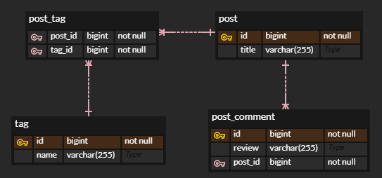
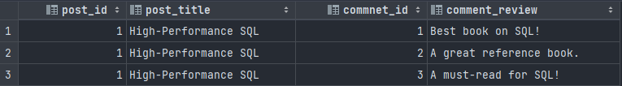
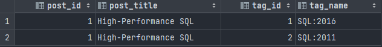
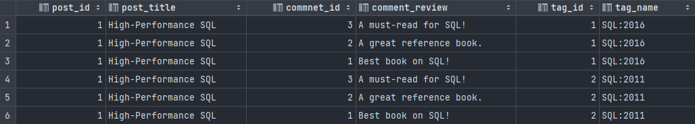

# Left Join에서의 Row Explosion과 JPA 연관관계

해당 글에서는 [인프런 JPA 개발자를 위한 고성능 SQL 강의](https://www.inflearn.com/course/vlad-high-performance-sql/dashboard) 일부를 보고 학습한 내용을 정리합니다.

---

# 1. DB 세팅

먼저 이번 학습에 필요한 Table 및 데이터를 생성해보자.

- 연관관계


- DDL
    ```sql
    CREATE TABLE post (
        id      BIGSERIAL       PRIMARY KEY,
        title   VARCHAR(255)    NOT NULL
    );
    
    CREATE TABLE tag (
        id      BIGSERIAL       PRIMARY KEY,
        name    VARCHAR(255)    NOT NULL
    );
    
    CREATE TABLE post_comment (
        id      BIGSERIAL       PRIMARY KEY,
        review  VARCHAR(255)    NOT NULL,
        post_id BIGINT          NOT NULL,
        
        CONSTRAINT fk_post_comment_post
            FOREIGN KEY (post_id)
            REFERENCES post (id)
            ON DELETE CASCADE 
    );
    
    CREATE TABLE post_tag (
        post_id BIGINT          NOT NULL,
        tag_id  BIGINT          NOT NULL,
        
        CONSTRAINT pk_post_tag
          PRIMARY KEY (post_id, tag_id),
        
        CONSTRAINT fk_post_tag_post
            FOREIGN KEY (post_id)
            REFERENCES post (id)
            ON DELETE CASCADE,
        
        CONSTRAINT fk_post_tag_tag
            FOREIGN KEY (tag_id)
            REFERENCES tag (id)
            ON DELETE CASCADE
    );
    ```
  
- DML
  ```sql
  INSERT INTO post (title)
  VALUES ('High-Performance SQL');
  
  INSERT INTO post_comment (post_id, review)
  VALUES (1, 'Best book on SQL!')
      ,  (1, 'A great reference book.')
      ,  (1, 'A must-read for SQL!')
  ;
  
  INSERT INTO tag (name)
  VALUES ('SQL:2016')
      ,  ('SQL:2011')
  ;
  
  INSERT INTO post_tag (post_id, tag_id)
  VALUES (1, 1)
      ,  (1, 2)
  ;
  ```
  
# 2. 기본 Left Join 쿼리 결과

## 1) post와 그에 달린 post_comment

```sql
SELECT 
    p.id as post_id, 
    p.title as post_title, 
    pc.id as commnet_id, 
    pc.review as comment_review
FROM post p 
LEFT JOIN post_comment pc
    ON p.id = pc.post_id
```


## 2) post와 그에 엮인 tag

```sql
SELECT
    p.id as post_id,
    p.title as post_title,
    t.id as tag_id,
    t.name as tag_name
FROM post p 
LEFT JOIN post_tag pt
    ON p.id = pt.post_id
LEFT JOIN tag t 
    ON pt.tag_id = t.id
```


# 3. 문제상황

post에 달린 댓글과 tag를 모두 한눈에 보고싶어졌다. 그래서 모두 한 번에 join을 시도한다.

```sql
SELECT 
    p.id as post_id, 
    p.title as post_title, 
    pc.id as commnet_id, 
    pc.review as comment_review,
    t.id as tag_id,
    t.name as tag_name
FROM post p 
LEFT JOIN post_comment pc ON p.id = pc.post_id
LEFT JOIN post_tag pt ON p.id = pt.post_id
LEFT JOIN tag t ON pt.tag_id = t.id
```



결과는 **댓글 3개 * 태그 2개 = 총 6개 행**이 나왔다.
즉, 카르테시안 곱처럼 보이는 `Row Explosion` 결과가 발생한 것이다.

### 왜 이런 상황이 발행했을까?

근본적인 이유는 `SQL은 테이블 형태`로 결과를 보여줘야 하기 때문이다.
개발자가 다루는 객체는 기본적으로 컬렉션 자료구조로 데이터를 표현할 수 있지만, 테이블은 그렇지 않기 때문에 결과값이 뻥튀기 되어 표현된다.

이 관계들에서 기준 엔티티는 **post**이다.
그리고 이 기준 엔티티에 대해 `서로 독립적인 컬렉션`을 가져오는데, 이 때 `동시에` 가져오기 때문에 이런 현상이 발생하는 것이다.

논리적인 개념으로 봐도 
1. `post-comment`는 `게시글과 그에 해당하는 댓글`로 하나의 컬렉션
2. `post-tag`는 `게시글과 그에 해당하는 테그`로 하나의 컬렉션

이렇게 각각의 컬렉션을 이룬다.
그러나 `tag-comment`는 아무 관계도 없는 사이이다.

따라서 이 두 컬렉션은 SQL로 한 번에 불러오기 보다는 각각 불러온 후에 애플리케이션 레벨에서 조합하는 것이 올바른 방법이다.
쿼리가 맞다/틀리다의 개념보다는, `데이터를 어떻게 쓸 것인가`의 문제인 것이다.

> 아 그렇구나, 잘 알겠다. 하고 넘어가려는 순간...
> 
> 머리속에서 번뜩 `JPA 연관관계와 N+1이 딱 이런 상황이구나`를 인지하게 되었다.

# 4. Row Explosion과 JPA 연관관계

해당 엔티티들을 JPA Entity로 작성해보자.

- post
  ```java
  @Entity
  public class Post {
  
      @Id
      @GeneratedValue
      private Long id;
  
      private String title;
  
      @OneToMany(mappedBy = "post")
      private List<PostComment> comments;
  
      @ManyToMany
      @JoinTable(
          name = "post_tag",
          joinColumns = @JoinColumn(name = "post_id"),
          inverseJoinColumns = @JoinColumn(name = "tag_id")
      )
      private List<Tag> tags;
  }
  ```

- post_comment
  ```java
  @Entity
  public class PostComment {
  
      @Id
      @GeneratedValue
      private Long id;
  
      private String review;
  
      @ManyToOne
      @JoinColumn(name = "post_id")
      private Post post;
  }
  ```
  
- tag
  ```java
  @Entity
  public class Tag {
  
      @Id
      @GeneratedValue
      private Long id;
  
      private String name;
  
      @ManyToMany(mappedBy = "tags")
      private List<Post> posts;
  }
  ```
  
물론 이렇게 연관관계를 최악으로 맺는 경우는 거의 없겠지만, 이런 관계에서 발생할 수 있는 쿼리가 바로 `Row Explosion` 쿼리일 것이다.

이런 관계에서 Left Join을 문제상황처럼 사용하게 되면 이 테이블을 Entity를 사용한 객체 그래프로 만들 때 Hibernate가 문제를 맞이한다.
```text
(post, comment1, tag1)
(post, comment1, tag2)
(post, comment2, tag1)
(post, comment2, tag2)
(post, comment3, tag1)
(post, comment3, tag2)
```
이런 결과물에서 
```java
Post post = new Post();

post.comments = ???
post.tags = ???
```
어떤 식의 컬럼데이터를 유지해야 하는지 판단 기준이 없기 때문이다.

따라서 사실 Hibernate는 이런 상황에서 예외를 던진다. 
```
org.hibernate.loader.MultipleBagFetchException:
cannot simultaneously fetch multiple bags
```

중복 데이터를 넣거나, 행이 뻥튀기 되어 메모리가 늘고 데이터가 깨지는 것보다 안전한 것을 선택하는 것이다.
개발자 입장에서 참 감사한 일이다.

# 5. 실무에서는 어떻게 쓸까?

JPA를 배울 때 인프런의 김영한 강사님에게 배운 것이 아직 기억이 난다.

### 1. 중간 매핑 테이블은 `@ManyToMany` 보다는 양쪽에 `@ManyToOne`을 두고 Entity로 의도적으로 승격시켜라. 

이는 도메인이 성숙해 질 수록 경험적으로 중간 테이블이 도메인관점에서 의미가 생기기 때문이라고 했다. 그리고 나도 동일한 경험을 실무에서 하게 됐다.

### 2. `@ManyToOne(fetch = FetchType.Lazy)` 관계를 위주로 사용해라. `@OneToMany`는 N+1, Row Explosion 등 신경쓸 것이 많아진다. 꼭! 필요한 경우에만 사용해라.

지금 이 문제 상황에 정확하게 필요한 솔루션이다. 테이블에서 FK를 가진 Entity가 연관관계의 주인이 되는 것이다.

객체 관점에서는 양방향 연관관계를 맺는 것이 매우 익숙하고 자연스럽다. 그러나, DB와 인터페이싱을 해야하는 관점에서는 어느정도 타협이 필요한 부분으로 보인다.

### No Silver Bullet.

`@OneToMany`는 한정적인 상황에서 편할 수 있다. 실무에서는 **무조건 같이 조회되는** 컬렉션의 경우에 한해서 저렇게 붙여서 쓰곤 했다.
그리고 그렇게 쓰면 편한 점이 분명히 존재한다.
반대로 `@ManyToOne`은 때에 따라 한번 더 쿼리를 날리는 경우가 발생한다.

```java
@Entity
@Table(name = "post")
public class Post {

  @Id
  @GeneratedValue(strategy = GenerationType.IDENTITY)
  private Long id;

  @Column(nullable = false)
  private String title;
}
```
```java
@Entity
@Table(name = "post_comment")
public class PostComment {

  @Id
  @GeneratedValue(strategy = GenerationType.IDENTITY)
  private Long id;

  @Column(nullable = false)
  private String review;

  @ManyToOne(fetch = FetchType.LAZY)
  @JoinColumn(name = "post_id")
  private Post post;
}
```

위와 같은 경우, Post를 조회한 후 Post로 한번 더 댓글 테이블에 쿼리를 날려야 한다.
이런 관계에서는 역시 Post 엔티티에 `@OneToMany`를 고려해볼 수 있지만, 내 지금까지의 누추한 경험상, 그래도 이 관계를 유지하는게 낫다.
대댓글이 생기는 경우도 있고, 댓글에 다른 연관관계가 생길 수 있는 가능성이 작게라도 있기 때문이다.

> `쿼리를 한 번 더 날리는 것`이 
> `나도 모르게 메모리가 터지는` 비용보다 싼 경우가 대부분이다.

이런 기준을 가지고 실무에 활용하자.