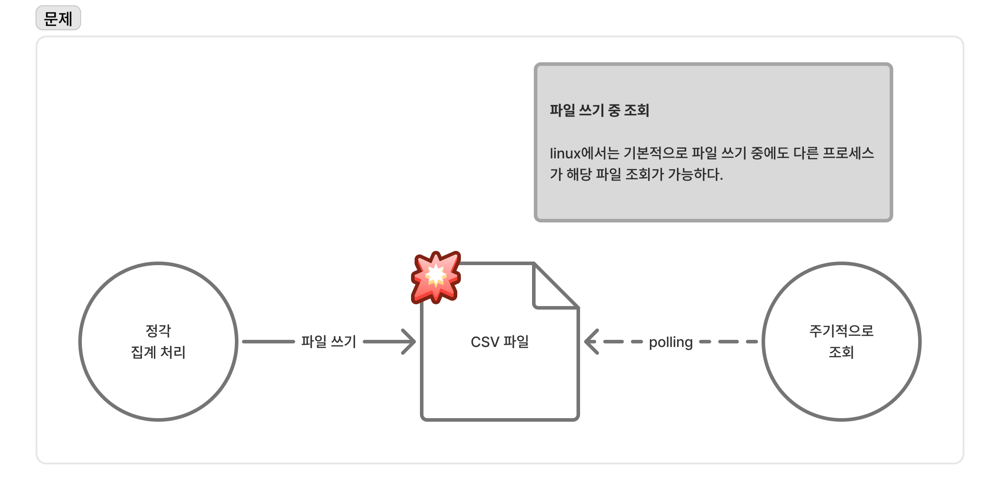
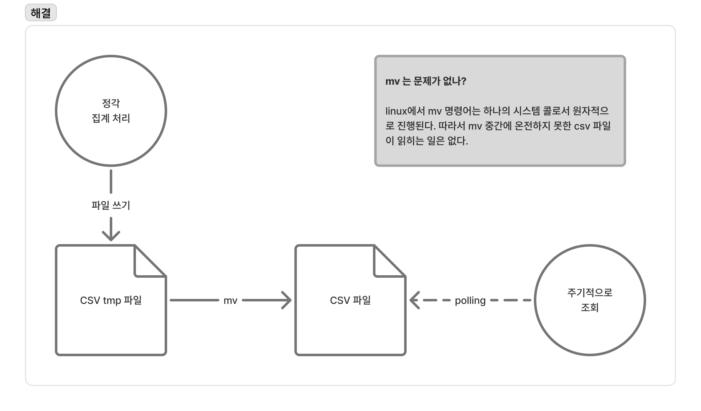
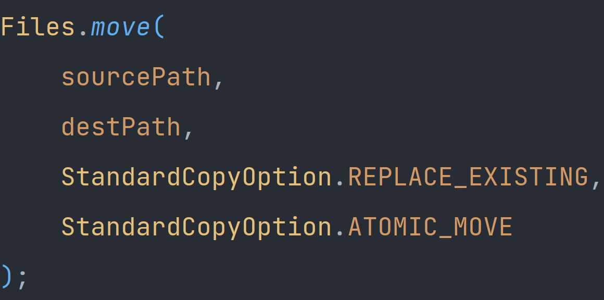

### 이 소스는 누가 어떻게 관리할 것인가 - 25.11.27

프로젝트 중 파일 I/O 경합상황에서 문제가 발생한 적이 있다.
매 시간 정각에 데이터를 집계하여 .csv 파일을 만드는 작업을 하는 프로세스가 하나 있고, 그 집계 데이터를 주기적으로 가져와서 사용하는 프로세스가 하나 있다.
그 과정에서 타이밍이 맞물리는 순간, 온전치 못한 파일을 읽을 때 오류가 났다.

경합 자원이기 때문에 당연히 발생할 수 있는 문제였다. 생각이 짧았고, tmp 파일을 작성한 후 기존 파일로 `mv`하는 방식으로 문제를 해결했다.

> 이 글을 쓰는 이유는 이 문제를 해결한 것에 대해서가 아니라, 이 과정에서 특정 작업물은 누가 어떻게 관리할 것인가에 대해서 생각해보게 되었기 때문이다.

---

서버에서 파일을 옮기는 방법은 여러가지가 있겠지만, 이 중 `1) 명령어를 실행하여 옮기는 방법`과 `2) 코드를 사용해 옮기는 방법`에 대해서 비교해본다.

1) 명령어를 실행하여 옮기는 방법
나는 파일 이동 작업을 서버에 mv 스크립트를 짜놓고, java api 서버에서 `ProcessBuilder`로 해당 스크립트를 실행하는 방식으로 동작을 시켰다.
잘 작동한다.

2) 코드를 사용해 옮기는 방법

java 코드로는 원자적 수행을 위해 추가적인 옵션이 들어간다. 
잘 작동한다.

> 문제는, java 코드 즉, 프로젝트에서는 해당 스크립트에 대해 의존적이라는거다. 그리고 그 스크립트가 `형상관리` 범위가 넘어간다는 것이다.

돌이켜 생각해보면, 스크립트 파일로 작성한 이유가 해당 작업 당시 여러가지 스크립트 파일로 파이썬 모듈을 호출하는 작업을 하고 있었을 때라 사고의 흐름이 자연스럽게 그렇게 흘러간 것 같다. 이미 만들어놓은 Util 클래스들을 활용하면 금방 만들 수 있었기 때문이다.

비슷한 상황이라고 생각할 수 있겠지만서도 근본적으로 다른점은 `파이썬 모듈은 다른 개발자에 의해 형상관리가 되고 있고 스크립트 파일은 형상관리 범위를 벗어난다는 점`이다.
이는 관리포인트를 늘게 하고, 비용과 실수를 유발하게 되는 지점이라는 것이다.

---
### 깨달은 점

1. 배치성 작업이 아닌 이상, 스크립트 파일보다는 코드 레벨에서 작업하자.
2. 어떤 파일, 코드 등을 만들 때는 `누가`, `어떻게` 관리할 것인지 고민하자.
3. 경합 자원은 동기화 문제를 잘 생각하자.