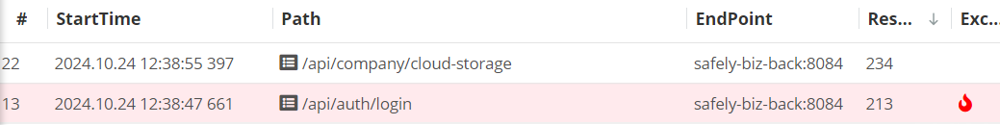

### 운영 서비스 Pinpoint 모니터링과 error status와의 관계에 대한 생각

현재 어떤 배포 서비스에서 모니터링 도구로 Pinpoint를 사용중이다. Pinpoint는 기본적으로 `500` 에러만 빨간색으로 찍히도록 설정되어 있었다.

처음에는 ‘왜 400번대 에러는 기본값이 아니지?’ 생각하면서 서버의 Exception 상황을 확인하기 위해 400번대를 추가했었다.

그러나 이번에 운영서버에서 발생한 인가처리 Exception 내용을 확인하면서, 근본적인 질문을 하게 되었다. 
‘내가 이 에러를 알아야하는것인가?’ 그리고 왜 기본적으로 500 에러만 찍히도록 해놓은지 알게 되었다.

백엔드 서버에서 관리하는 Exception은 간단하게 아래와 같다.

| Exception | 에러코드 | 비고 |
| --- | --- | --- |
| `InvalidArgumentException` | 400 | 유저 파라미터 오류 등의 input값으로 인해 유저의 요청을 실행할 수 없는 경우 |
| `AuthenticatedException` | 401 | 인증 에러 |
| `PermissionException` | 403 | 인가 에러 |
| `InternalServerException` | 500 | 서버 에러 |
| `FailedOCRException` | 500 | OCR 에러 |
| `TimeoutException` | 500 | DB Lock 에러 |

모니터링의 목적이 `서버에서 나오는 모든 예외를 확인하겠다`라면 400번대 에러도 찍히는게 맞는데, 모니터링 도구는 유저의 input으로 잘못되는 것은 굳이 알 필요가 없을 수 있다. 때문에 500만 기본값으로 해놓은 것일거라는 추측이 가능해졌다. 개발자가 실제로 모니터링해야하는 상황은 예기치 못한 500 에러일 가능성이 높기 때문이다.

물론 ‘코드가 잘 짜여져있고 테스트 코드로 커버가 되어있다’는 가정이 필요하긴 할 것이다.