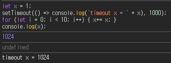

# Node.js 개요

---

# 1. Node.js의 탄생

## 1) javascript

- 브라우저 내에서 HTML 조작을 위해 만들어진 언어

## 2) 브라우저 엔진

- 자바스크립트 해석을 하는 주체
- V8(Chrome), IE(Chakra), Firefox(SpiderMonkey) 등

## 3) V8 엔진의 브라우저 탈출

- 2008년 등장한 V8 엔진의 기능이 좋아 2009년 Ryan Dahl에 의해 libuv 라는 비동기 이벤트 처리 라이브러리와 함께 결합한 `Node.js`가 출시됨

# 2. Node.js란?

> Node.js는 비동기 이벤트 기반의 JavaScript 런타임으로, 확장 가능한 네트워크 애플리케이션을 구축하도록 설계되었습니다. *-[nodejs.org](https://nodejs.org/ko/about) 에서의 소개글*

나는 Node.js를

1. javascript를 브라우저 밖에서 실행할 수 있게 해주는 `런타임 환경`과 
2. 서버 개발에 필요한 `기본 도구를 제공`하고 
3. npm 생태계로 확장성을 더한 

`서버 개발 플랫폼` 이라고 정의하고 싶다.

# 3. Node.js의 특징

`Event-driven(Event-loop)`, `Non-blocking I/O`, `Asynchronous`, `Single-thread`

이 특성들은 궁극적으로 `멀티태스킹`을 편리하게 구현할 수 있도록 해주기 위함이다.

## 1) Single-thread

정확하게는 javascript 코드를 실행하는 Node.js의 메인 스레드가 오직 1개라는 뜻이다.
이는 멀티 스레딩 환경에서 동기화와 같은 복잡한 상황을 처리하지 않아도 되도록 해준다.

Node.js의 내부적인 관점에서는 멀티스레드로 여러 작업(I/O작업, 네트워크 요청 등)을 처리한다. (기본 스레드 풀은 4개)
단, 개발자가 작성하는 코드 밖의 일이다.

- 메인 스레드가 오직 1개인 상황을 잘 표현해주는 코드 (Java 위주로 개발해왔어서 낯설다...)

## 2) Non-blocking & Asynchronous

이 둘은 보통 혼합하여 사용하는게 흔한데, Node.js에서는 I/O 작업이나 시간이 걸리는 작업은 비동기적으로 진행된다.
따라서 메인 스레드는 크게 신경쓰지 않고 Non-blocking으로 계속 javascript 코드를 실행해간다.

## 3) Event-driven(Event-loop)

이러한 메인 스레드 작업사이클을 `이벤트 루프`라고 부른다.
- `javascript 코드 실행` -> `비동기 작업을 큐에 등록하고 대기` -> `완료된 작업 처리`

# 4. 브라우저 환경과 Node.js 환경

Node.js가 Chrome의 javascript 해석 엔진인 `V8`로 시작했음을 언급했다. 그러면 Node.js와 브라우저 환경은 어떤 차이가 있을까?

## 1) 공통점

`V8` 엔진이 javascript 코드를 실행하는 런타임 환경이 된다는 점

## 2) 차이점

- 크롬 브라우저는 `웹 페이지 렌더링 및 사용자 인터렉션 처리`가 주 목적 -> `Web API`를 추가로 제공
- Node.js는 `서버 사이드 애플리케이션 실행`이 주 목적 -> `fs, http`와 같은 서버 작업 라이브러리를 추가로 제공

즉, `V8`엔진을 공유하지만 그 위에 얹어진 `라이브러리`가 다르다고 보면 될 것이다.

# 5. Java 개발자의 관점

완벽히 대응되지는 않겠지만, 이렇게 매핑해볼 수 있겠다.

|항목| Node.js  | Java   |
|---|----------|--------|
|런타임| V8 엔진    | JVM    |
|플랫폼| Node.js (V8 + 모듈) | JDK (JVM + 표준 라이브러리)   |
|프레임워크| Nest.js  | Spring |

## 런타임 비교 및 하드웨어 플랫폼 종속성

### JVM
- 소스 코드 -(javac)→ 바이트코드 → 인터프리터/JIT → 네이티브 기계어 최적화
- 바이트코드가 플랫폼 독립적이며, JVM이 각 플랫폼에 맞춰 실행하므로 플랫폼 독립적임

### V8
- 소스 코드 -(파싱)→ 바이트코드(라고 표현, 외부적으로 사용하지 않음) → 인터프리터(Ignition)/JIT(TurboFan) → 네이티브 기계어 최적화
- V8 엔진이 특정 아키텍처에 맞춰 빌드되고, 네이티브 기계어가 플랫폼별로 생성되므로 플랫폼 종속적임

---

### 참고자료

- [Node.js 공식문서](https://nodejs.org/ko/learn/getting-started/introduction-to-nodejs)
- [코딩애플 유튜브](https://youtu.be/k2GWnDb5zoQ?si=qu5lJjeojB0H4096)
- [얄팍한 코딩사전 유튜브](https://youtu.be/i47_HXjGjA0?si=hCQn0OGTpgEEd4SM)